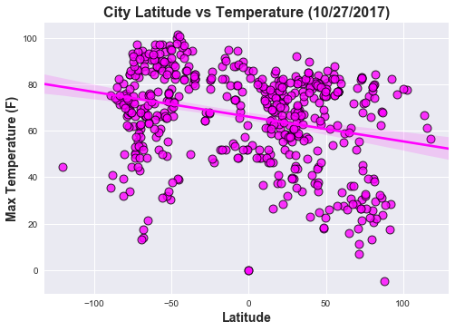
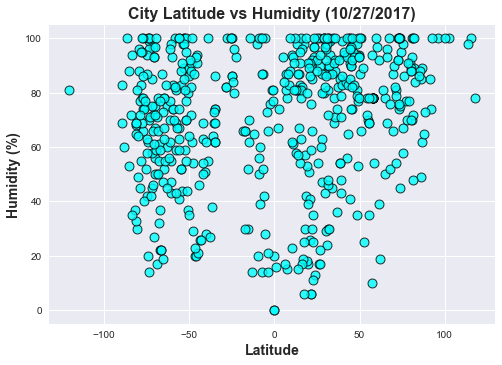
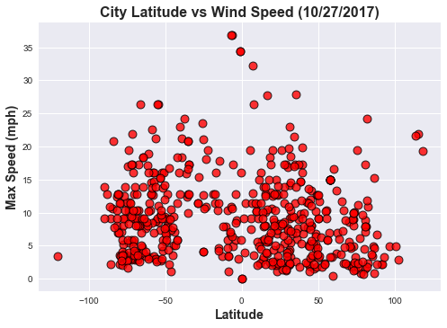

```python
# Dependencies
from matplotlib.figure import Figure
import matplotlib.pyplot as plt
import matplotlib.dates as mdates
import pandas as pd
import numpy as np
import seaborn as sns
from citipy import citipy as cp
from datetime import datetime
from random import uniform
import random as rd

np.random.seed(sum(map(ord, "aesthetics")))

# Here is some documentation that describes how to remove API keys from GitHub. 
# https://gist.github.com/derzorngottes/3b57edc1f996dddcab25

# Created my api key for openweathermap.org/api   key name = myOWM
# Used my comcast email id and chrisg4owm
api_owmkey = "b28cc4b4c0a1d1d9ff4c2d9e808f9a5a"

# Created 2nd api key for openweathermap.org/api   key name = OWM1
# Used my gmail id and chrisg4owm2
# api_owmkey = "694332937bad44a33dd12de17c5e78e8"  

# Created 2nd api key for openweathermap.org/api   key name = OWM2
# Used my gmail id and chrisg4owm2
# api_owmkey = "44db84fb592301e3b8e80fd68c27e847"  
```

# Background Information on Latitude and Longitude:

## Latitude
In geography, latitude is a geographic coordinate that specifies 
the north–south position of a point on the Earth's surface. 
Latitude is an angle (defined below) which ranges from 0° at the 
Equator to 90° (North or South) at the poles.

While lines of latitude run across a map east-west, the point of 
latitude makes the north-south position of a point on earth.  
Lines of latitude start at 0 degrees at the equator and end a 90 
degrees at the North and South Poles.  Everything north of the 
equator is known as the Northern Hemisphere and everything south 
of the equator is known as the Southern Hemisphere.

Lines of latitude are called parallels and in total there are 180 
degrees of latitude.  The distance between each degree of 
latitude is about 69 miles (110 kilometers).  The five major 
parallels of latitudes from north to south are called: Arctic 
Circle, Tropic of Cancer, Equator, Tropic of Capricorn, and the 
Antarctic Circle. On a maps where the orientation of the map is 
either due north or due south, latitude appears as horizontal lines.

## Longitude
Longitude is the measurement east or west of the prime meridian. 
Longitude is measured by imaginary lines that run around the Earth 
vertically (up and down) and meet at the North and South Poles. 
These lines are known as meridians.

Longitude lines run north-south and mark the position east-west of 
a point. Lines of longitude are known as meridians.  These lines run 
from pole to pole, crossing the equator at right angles. There are 
360 degrees of latitude and the latitude line of 0 degrees is known 
as the Prime Meridian and it divides the world into the Eastern 
Hemisphere and the Western Hemisphere (-180 degrees degrees of 
longitude west and 180 degrees of longitude east).

The distance between longitudes narrows the further away from the 
equator.  The distance between longitudes at the equator is the same 
as latitude, roughly 69 miles. At 45 degrees north or south, the 
distance between is about 49 miles (79 km). The distance between 
longitudes reaches zero at the poles as the lines of meridian 
converge at that point.

The Prime Meridian is at 0 degrees longitude, just as the equator is at 
0 degrees latitude


# Weather Plot Trend Analysis 

This is a study of weather in cities around the globe, the gathering
of data, creation of charts, and analysis of the results.  Geography
and remembering geography lessons from too many years ago played a 
large part in the proper gathering of the data. To get a reasonable 
distribution of data points, I choose the method of dividing the 
earth into quadrants using the image on the right.  From the image, 
I used the x-axis as latitude -180.0 to 180.0(Far West to Far East), 
and the y-axis was -90.0 to 90.0.

The data gathering steps were as follows: one, the program uses a 
list of 4 tuples which were the ranges -180 to 180, and those are 
passed along with a constant tuple (-90,90) to two random.uniform 
functions which generated x and y coordinates.  Two, the list of 
geo-coordinates are passed to a library called citipy which found 
the nearest city with a population greater than 500.  Three, 
duplicates city, country records were deleted and the process was 
repeated until at least 500 cities are gathered.  Four, with the 
city and country, the program makes requests to the Open Weather 
Map's API to gather the date, latitude, longitude, max temperature, 
humidity, cloudiness, and wind speed.  The gathered data is then 
used to create the plots using matplotlib and seaborn modules.  

Latitude and longitude are imaginary (unreal) lines drawn on maps 
to easily locate places on the Earth. Latitude is distance north 
or south of the equator (an imaginary circle around the Earth 
halfway between the North Pole and the South Pole) and longitude 
is distance east or west of the prime meridian (an imaginary line 
running from north to south through Greenwich, England). Both are 
measured in terms of the 360 degrees (symbolized by °) of a circle.

Lines of latitude start at 0 degrees at the equator and end a 90 
degrees at the North and South Poles.  Everything north of the 
equator is known as the Northern Hemisphere and everything south 
of the equator is known as the Southern Hemisphere.  Lines of 
latitude are called parallels and in total there are 180 degrees 
of latitude.

Longitude is the measurement east or west of the prime meridian. 
Longitude is measured by imaginary lines that run around the Earth 
vertically (up and down) and meet at the North and South Poles. 
These lines are known as meridians.

Overall, the point of the exercise was to understand the data (in 
geo-coordinate terms), to understand what questions we were are trying 
to answer, and how to best present that data to tell the story.  

## Data Trend Analysis

I'm not sure how it would be done but the charts would have been more 
informative with longitude as the y-axis and the choosen y-axis 
(temperature in this case) as a third variable.  This would make a better 
picture of the distribution because I could tell where the city was on the line 
of longitude.  

For the temperature trend, I can tell where a city lies in terms
of latitude in relation to the prime meridian which allows me to make some
assumptions because I know the continents and where the prime meridian
cuts across the continents.  From this I would say the trend shows that 
cities are concentrated in areas of moderate climate.  Cities avoid the 
extreme cold of the north and south poles, there are fewer cities in areas
above 80 degrees and below 60 degrees fahrenheit.  If I look at temperature
wind, and humidity together, I think they confirm the clustering trend of 
cities and people in moderate climate areas.

I found the data points for cloudiness chart were spread out and while there
were linear associations, the associations were in five different cloudiness
percentages.  So it is difficult to decipher a trend without more data over a
longer period of time. 

Looking at the humidity chart, we can see that humidity is  present in all but 
the most extreme locations.  The chart  also shows that humidity doesn't 
seem to effect distributions of cities.  Cities seem to be evenly spread out '
across the various levels.  

Looking at the wind speed chart confirmed that wind speeds reported  in my 
area where winds up to 20 mph are within the normal distribution where a 
large number of cities lie.

Understanding the data in geo-coordinate terms, or where the city was located
was very important to being able to infer conclusions.  Also, gathering the data
(free data), was difficult because of overusing the API.  My API stopped working
and I had to acquire additional keys to complete my work.


# Divide the earth into quadrants

Quad4-far west  = (-180.0 | -90.0)  (-90.0 | 90.0)

Quad3-near west =  (-90.0 | 0.0)    (-90.0 | 90.0)

Quad2-near east =  (0.0   |  90.0)  (-90.0 | 90.0)

Quad1-far east  =  (90.0  | 180.0)  (-90.0 | 90.0)


```python
# Generate a list of 500+ unique cities from all around the earth.
# -----------------------------------------------------------------

# Set to True for print statements
Debug = False

list_length = 275

# final data frame that's empty
city_wdf = pd.DataFrame() 
city_wdf["city"] = ""
city_wdf["country"] = ""

# used for loading geo coordinates 
load_count = 0   
# max number of iterations per quadrant
clean_count = 0  

# list of latitude range tuples Far West to Far East
quad_lat = [(-180,-90), (-90,0), (0,90), (90,180)]

# -----------------------------------------------------------------

# Loop thru latitude tuples
for a in quad_lat:
    # working data frame that's empty
    city_tmp = pd.DataFrame()
    city_tmp["city"] = ""
    city_tmp["country"] = ""
    
    # prevents infinite loop
    clean_count = 0
    # used to set the index for city_tmp
    counter = 0      
    
    # Pass tuple values into while loop
    b,c = a[0], a[1]
    print("Current tuple ", a)
    print("b = " + str(b) + " c = " + str(c))
    print("Pass b, c to while loop...")
    
    while len(city_tmp.index)<= list_length:
        
        geo_list = [] 
        load_count = counter
        if Debug:
            print("Length city_tmp ", len(city_tmp.index))
            print("counter is ", counter)
            print("load_count is ", load_count)
        
        # Append tuples of coordinates to the geo_list
        while load_count <= list_length:
            tup = ()
            x,y = uniform(b,c), uniform(-90, 90)
            x = np.round(x,2)
            y = np.round(y,2)
            if Debug:
                print("x ", x)
                print("y ", y)
            tup = (x,y)
            geo_list.append(tup)
            load_count += 1
        
        if Debug:
            print("Length of geo_list ",len(geo_list))
        
        # get the list of city, country values and update working data frame
        for i in range(0, len(geo_list)):
            x,y = geo_list[i]
            city = cp.nearest_city(x, y)
            if Debug:
                print(city.city_name,end=", ")     
                print(city.country_code)  
            city_tmp.set_value(counter,"city", city.city_name)
            city_tmp.set_value(counter,"country", city.country_code)
            counter += 1
        if Debug:
            print("Length of city_tmp ",len(city_tmp))
            print("Before clean up ", city_tmp)
            
        # Clean up the data frame
        # Sort the data by city, country
        city_tmp.sort_values(["city","country"],ascending=[True, False], inplace=True) 

        # Remove duplicate city, country rows
        city_tmp = city_tmp.drop_duplicates(subset=["city","country"], 
                                        keep="last").reset_index(drop=True)
        
        # Reset the counter for the next loop
        counter = len(city_tmp.index) + 1
        
        clean_count += 1
        # Prevent infinite loop
        if clean_count == 18:
            break
        
        if Debug:
            print("After clean up length of city_tmp ",len(city_tmp))
            print("After clean up counter is ", counter)
    
    # concatenate working data frame to final data frame
    city_wdf = pd.concat([city_wdf, city_tmp])
    print(len(city_wdf))            
        
            
if Debug:    
    print(len(city_wdf.index))
    print()
    print(city_wdf)
```

    Current tuple  (-180, -90)
    b = -180 c = -90
    Pass b, c to while loop...
    10
    Current tuple  (-90, 0)
    b = -90 c = 0
    Pass b, c to while loop...
    274
    Current tuple  (0, 90)
    b = 0 c = 90
    Pass b, c to while loop...
    549
    Current tuple  (90, 180)
    b = 90 c = 180
    Pass b, c to while loop...
    563
    


```python
# Final clean up of the city data frame
city_wdf = city_wdf.sort_values(["city","country"],
                                ascending=[True, False]).reset_index(drop=True)

print(len(city_wdf.index))

# Remove duplicate city, country rows and rebuild the index
city_wdf = city_wdf.drop_duplicates(subset=["city","country"],
                                    keep="last").reset_index(drop=True)

# Add the rest of the columns once we have 500+ cities
city_wdf["date"] = ""
city_wdf["lat"] = 0.0
city_wdf["lng"] = 0.0
city_wdf["max_temperature"] = 0.0
city_wdf["humidity"] = 0.0
city_wdf["cloudiness"] = 0.0
city_wdf["wind_speed"] = 0.0

print(len(city_wdf.index))
# city_wdf.head(10)
```

    563
    536
    


```python
# Make OpenWeatherMap api calls.  
# http://openweathermap.org/api  - this has the API documentation
#
# API call: 
# api.openweathermap.org/data/2.5/weather?q={city},{country}&unit={unit}&APPID={key} 
# city name and country code divided by comma, (use ISO 3166 country codes)
#
# API example: city = aasiaat country = gl
# http://api.openweathermap.org/data/2.5/weather?q=aasiaat,gl&units=imperial&APPID=key
# Or
# http://api.openweathermap.org/data/2.5/weather?appid=key&q=aasiaat,gl&units=imperial

import json
import requests as req

error_count = 0

for index, row in city_wdf.iterrows():
    url = "http://api.openweathermap.org/data/2.5/weather?"
    city = row["city"]
    country = row["country"]
    units = "imperial"
    

    # Build query URL
    query_url = url + "q=" + city + "," + country \
                + "&units=" + units + "&APPID=" + api_owmkey 
    
    try:
        # Get weather data
        city_weather = req.get(query_url).json()
        #print("The weather API responded with: " + json.dumps(city_weather, indent=2) + ".")
        print("Row index: " + str(index) + " | " + row["city"] + "," + row["country"] +
              " -- query_url: " + query_url)
        
        # OWM dt (date) = Time of data load, GMT Unix timestamp (UTC) 
        friendly_date = datetime.fromtimestamp(int(city_weather["dt"])).strftime('%Y-%m-%d %H:%M:%S')
        
        city_wdf.set_value(index, "date", friendly_date)
        city_wdf.set_value(index, "lat", city_weather["coord"]["lon"])
        city_wdf.set_value(index, "lng", city_weather["coord"]["lat"])
        city_wdf.set_value(index, "max_temperature", city_weather["main"]["temp_max"])
        city_wdf.set_value(index, "humidity", city_weather["main"]["humidity"])
        city_wdf.set_value(index, "cloudiness", city_weather["clouds"]["all"])
        city_wdf.set_value(index, "wind_speed", city_weather["wind"]["speed"])
    
    except KeyError:
        print("The key doesn't exist: " + row["city"] + ", " + row["country"] + "." )
        print(KeyError)
        error_count += 1
        
print("Total errors: ", error_count)
#city_wdf.head()
```

    Row index: 0 | abay,kz -- query_url: http://api.openweathermap.org/data/2.5/weather?q=abay,kz&units=imperial&APPID=b28cc4b4c0a1d1d9ff4c2d9e808f9a5a
    Row index: 1 | abu samrah,qa -- query_url: http://api.openweathermap.org/data/2.5/weather?q=abu samrah,qa&units=imperial&APPID=b28cc4b4c0a1d1d9ff4c2d9e808f9a5a
    Row index: 2 | acari,pe -- query_url: http://api.openweathermap.org/data/2.5/weather?q=acari,pe&units=imperial&APPID=b28cc4b4c0a1d1d9ff4c2d9e808f9a5a
    Row index: 3 | achikulak,ru -- query_url: http://api.openweathermap.org/data/2.5/weather?q=achikulak,ru&units=imperial&APPID=b28cc4b4c0a1d1d9ff4c2d9e808f9a5a
    Row index: 4 | aden,ye -- query_url: http://api.openweathermap.org/data/2.5/weather?q=aden,ye&units=imperial&APPID=b28cc4b4c0a1d1d9ff4c2d9e808f9a5a
    Row index: 5 | adrar,dz -- query_url: http://api.openweathermap.org/data/2.5/weather?q=adrar,dz&units=imperial&APPID=b28cc4b4c0a1d1d9ff4c2d9e808f9a5a
    Row index: 6 | aflu,dz -- query_url: http://api.openweathermap.org/data/2.5/weather?q=aflu,dz&units=imperial&APPID=b28cc4b4c0a1d1d9ff4c2d9e808f9a5a
    Row index: 7 | agadez,ne -- query_url: http://api.openweathermap.org/data/2.5/weather?q=agadez,ne&units=imperial&APPID=b28cc4b4c0a1d1d9ff4c2d9e808f9a5a
    Row index: 8 | agrestina,br -- query_url: http://api.openweathermap.org/data/2.5/weather?q=agrestina,br&units=imperial&APPID=b28cc4b4c0a1d1d9ff4c2d9e808f9a5a
    Row index: 9 | agucadoura,pt -- query_url: http://api.openweathermap.org/data/2.5/weather?q=agucadoura,pt&units=imperial&APPID=b28cc4b4c0a1d1d9ff4c2d9e808f9a5a
    Row index: 10 | aguimes,es -- query_url: http://api.openweathermap.org/data/2.5/weather?q=aguimes,es&units=imperial&APPID=b28cc4b4c0a1d1d9ff4c2d9e808f9a5a
    Row index: 11 | aiken,us -- query_url: http://api.openweathermap.org/data/2.5/weather?q=aiken,us&units=imperial&APPID=b28cc4b4c0a1d1d9ff4c2d9e808f9a5a
    Row index: 12 | albac,ro -- query_url: http://api.openweathermap.org/data/2.5/weather?q=albac,ro&units=imperial&APPID=b28cc4b4c0a1d1d9ff4c2d9e808f9a5a
    Row index: 13 | albany,au -- query_url: http://api.openweathermap.org/data/2.5/weather?q=albany,au&units=imperial&APPID=b28cc4b4c0a1d1d9ff4c2d9e808f9a5a
    Row index: 14 | alta floresta,br -- query_url: http://api.openweathermap.org/data/2.5/weather?q=alta floresta,br&units=imperial&APPID=b28cc4b4c0a1d1d9ff4c2d9e808f9a5a
    Row index: 15 | ambalavao,mg -- query_url: http://api.openweathermap.org/data/2.5/weather?q=ambalavao,mg&units=imperial&APPID=b28cc4b4c0a1d1d9ff4c2d9e808f9a5a
    Row index: 16 | ambilobe,mg -- query_url: http://api.openweathermap.org/data/2.5/weather?q=ambilobe,mg&units=imperial&APPID=b28cc4b4c0a1d1d9ff4c2d9e808f9a5a
    Row index: 17 | amderma,ru -- query_url: http://api.openweathermap.org/data/2.5/weather?q=amderma,ru&units=imperial&APPID=b28cc4b4c0a1d1d9ff4c2d9e808f9a5a
    Row index: 18 | anapskaya,ru -- query_url: http://api.openweathermap.org/data/2.5/weather?q=anapskaya,ru&units=imperial&APPID=b28cc4b4c0a1d1d9ff4c2d9e808f9a5a
    Row index: 19 | anar darreh,af -- query_url: http://api.openweathermap.org/data/2.5/weather?q=anar darreh,af&units=imperial&APPID=b28cc4b4c0a1d1d9ff4c2d9e808f9a5a
    Row index: 20 | ancud,cl -- query_url: http://api.openweathermap.org/data/2.5/weather?q=ancud,cl&units=imperial&APPID=b28cc4b4c0a1d1d9ff4c2d9e808f9a5a
    Row index: 21 | angicos,br -- query_url: http://api.openweathermap.org/data/2.5/weather?q=angicos,br&units=imperial&APPID=b28cc4b4c0a1d1d9ff4c2d9e808f9a5a
    Row index: 22 | ankpa,ng -- query_url: http://api.openweathermap.org/data/2.5/weather?q=ankpa,ng&units=imperial&APPID=b28cc4b4c0a1d1d9ff4c2d9e808f9a5a
    Row index: 23 | antalaha,mg -- query_url: http://api.openweathermap.org/data/2.5/weather?q=antalaha,mg&units=imperial&APPID=b28cc4b4c0a1d1d9ff4c2d9e808f9a5a
    Row index: 24 | antofagasta,cl -- query_url: http://api.openweathermap.org/data/2.5/weather?q=antofagasta,cl&units=imperial&APPID=b28cc4b4c0a1d1d9ff4c2d9e808f9a5a
    Row index: 25 | arica,cl -- query_url: http://api.openweathermap.org/data/2.5/weather?q=arica,cl&units=imperial&APPID=b28cc4b4c0a1d1d9ff4c2d9e808f9a5a
    Row index: 26 | aripuana,br -- query_url: http://api.openweathermap.org/data/2.5/weather?q=aripuana,br&units=imperial&APPID=b28cc4b4c0a1d1d9ff4c2d9e808f9a5a
    Row index: 27 | ariquemes,br -- query_url: http://api.openweathermap.org/data/2.5/weather?q=ariquemes,br&units=imperial&APPID=b28cc4b4c0a1d1d9ff4c2d9e808f9a5a
    Row index: 28 | arkhipo-osipovka,ru -- query_url: http://api.openweathermap.org/data/2.5/weather?q=arkhipo-osipovka,ru&units=imperial&APPID=b28cc4b4c0a1d1d9ff4c2d9e808f9a5a
    Row index: 29 | arlit,ne -- query_url: http://api.openweathermap.org/data/2.5/weather?q=arlit,ne&units=imperial&APPID=b28cc4b4c0a1d1d9ff4c2d9e808f9a5a
    Row index: 30 | arnprior,ca -- query_url: http://api.openweathermap.org/data/2.5/weather?q=arnprior,ca&units=imperial&APPID=b28cc4b4c0a1d1d9ff4c2d9e808f9a5a
    Row index: 31 | arraial do cabo,br -- query_url: http://api.openweathermap.org/data/2.5/weather?q=arraial do cabo,br&units=imperial&APPID=b28cc4b4c0a1d1d9ff4c2d9e808f9a5a
    Row index: 32 | asfi,ma -- query_url: http://api.openweathermap.org/data/2.5/weather?q=asfi,ma&units=imperial&APPID=b28cc4b4c0a1d1d9ff4c2d9e808f9a5a
    Row index: 33 | astara,az -- query_url: http://api.openweathermap.org/data/2.5/weather?q=astara,az&units=imperial&APPID=b28cc4b4c0a1d1d9ff4c2d9e808f9a5a
    Row index: 34 | asyut,eg -- query_url: http://api.openweathermap.org/data/2.5/weather?q=asyut,eg&units=imperial&APPID=b28cc4b4c0a1d1d9ff4c2d9e808f9a5a
    Row index: 35 | atar,mr -- query_url: http://api.openweathermap.org/data/2.5/weather?q=atar,mr&units=imperial&APPID=b28cc4b4c0a1d1d9ff4c2d9e808f9a5a
    Row index: 36 | attawapiskat,ca -- query_url: http://api.openweathermap.org/data/2.5/weather?q=attawapiskat,ca&units=imperial&APPID=b28cc4b4c0a1d1d9ff4c2d9e808f9a5a
    Row index: 37 | auka,hn -- query_url: http://api.openweathermap.org/data/2.5/weather?q=auka,hn&units=imperial&APPID=b28cc4b4c0a1d1d9ff4c2d9e808f9a5a
    Row index: 38 | awbari,ly -- query_url: http://api.openweathermap.org/data/2.5/weather?q=awbari,ly&units=imperial&APPID=b28cc4b4c0a1d1d9ff4c2d9e808f9a5a
    Row index: 39 | awjilah,ly -- query_url: http://api.openweathermap.org/data/2.5/weather?q=awjilah,ly&units=imperial&APPID=b28cc4b4c0a1d1d9ff4c2d9e808f9a5a
    Row index: 40 | babati,tz -- query_url: http://api.openweathermap.org/data/2.5/weather?q=babati,tz&units=imperial&APPID=b28cc4b4c0a1d1d9ff4c2d9e808f9a5a
    Row index: 41 | bagotville,ca -- query_url: http://api.openweathermap.org/data/2.5/weather?q=bagotville,ca&units=imperial&APPID=b28cc4b4c0a1d1d9ff4c2d9e808f9a5a
    Row index: 42 | bajil,ye -- query_url: http://api.openweathermap.org/data/2.5/weather?q=bajil,ye&units=imperial&APPID=b28cc4b4c0a1d1d9ff4c2d9e808f9a5a
    Row index: 43 | balao,ec -- query_url: http://api.openweathermap.org/data/2.5/weather?q=balao,ec&units=imperial&APPID=b28cc4b4c0a1d1d9ff4c2d9e808f9a5a
    Row index: 44 | ballitoville,za -- query_url: http://api.openweathermap.org/data/2.5/weather?q=ballitoville,za&units=imperial&APPID=b28cc4b4c0a1d1d9ff4c2d9e808f9a5a
    Row index: 45 | bambous virieux,mu -- query_url: http://api.openweathermap.org/data/2.5/weather?q=bambous virieux,mu&units=imperial&APPID=b28cc4b4c0a1d1d9ff4c2d9e808f9a5a
    Row index: 46 | bandar-e lengeh,ir -- query_url: http://api.openweathermap.org/data/2.5/weather?q=bandar-e lengeh,ir&units=imperial&APPID=b28cc4b4c0a1d1d9ff4c2d9e808f9a5a
    Row index: 47 | bandarbeyla,so -- query_url: http://api.openweathermap.org/data/2.5/weather?q=bandarbeyla,so&units=imperial&APPID=b28cc4b4c0a1d1d9ff4c2d9e808f9a5a
    Row index: 48 | bandundu,cd -- query_url: http://api.openweathermap.org/data/2.5/weather?q=bandundu,cd&units=imperial&APPID=b28cc4b4c0a1d1d9ff4c2d9e808f9a5a
    Row index: 49 | barawe,so -- query_url: http://api.openweathermap.org/data/2.5/weather?q=barawe,so&units=imperial&APPID=b28cc4b4c0a1d1d9ff4c2d9e808f9a5a
    Row index: 50 | barcelos,br -- query_url: http://api.openweathermap.org/data/2.5/weather?q=barcelos,br&units=imperial&APPID=b28cc4b4c0a1d1d9ff4c2d9e808f9a5a
    Row index: 51 | barentsburg,sj -- query_url: http://api.openweathermap.org/data/2.5/weather?q=barentsburg,sj&units=imperial&APPID=b28cc4b4c0a1d1d9ff4c2d9e808f9a5a
    The key doesn't exist: barentsburg, sj.
    <class 'KeyError'>
    Row index: 52 | bataipora,br -- query_url: http://api.openweathermap.org/data/2.5/weather?q=bataipora,br&units=imperial&APPID=b28cc4b4c0a1d1d9ff4c2d9e808f9a5a
    Row index: 53 | bathsheba,bb -- query_url: http://api.openweathermap.org/data/2.5/weather?q=bathsheba,bb&units=imperial&APPID=b28cc4b4c0a1d1d9ff4c2d9e808f9a5a
    Row index: 54 | beira,mz -- query_url: http://api.openweathermap.org/data/2.5/weather?q=beira,mz&units=imperial&APPID=b28cc4b4c0a1d1d9ff4c2d9e808f9a5a
    Row index: 55 | bela,pk -- query_url: http://api.openweathermap.org/data/2.5/weather?q=bela,pk&units=imperial&APPID=b28cc4b4c0a1d1d9ff4c2d9e808f9a5a
    Row index: 56 | belushya guba,ru -- query_url: http://api.openweathermap.org/data/2.5/weather?q=belushya guba,ru&units=imperial&APPID=b28cc4b4c0a1d1d9ff4c2d9e808f9a5a
    Row index: 57 | belyy yar,ru -- query_url: http://api.openweathermap.org/data/2.5/weather?q=belyy yar,ru&units=imperial&APPID=b28cc4b4c0a1d1d9ff4c2d9e808f9a5a
    Row index: 58 | bengkulu,id -- query_url: http://api.openweathermap.org/data/2.5/weather?q=bengkulu,id&units=imperial&APPID=b28cc4b4c0a1d1d9ff4c2d9e808f9a5a
    Row index: 59 | benguela,ao -- query_url: http://api.openweathermap.org/data/2.5/weather?q=benguela,ao&units=imperial&APPID=b28cc4b4c0a1d1d9ff4c2d9e808f9a5a
    Row index: 60 | berlevag,no -- query_url: http://api.openweathermap.org/data/2.5/weather?q=berlevag,no&units=imperial&APPID=b28cc4b4c0a1d1d9ff4c2d9e808f9a5a
    Row index: 61 | biltine,td -- query_url: http://api.openweathermap.org/data/2.5/weather?q=biltine,td&units=imperial&APPID=b28cc4b4c0a1d1d9ff4c2d9e808f9a5a
    Row index: 62 | birao,cf -- query_url: http://api.openweathermap.org/data/2.5/weather?q=birao,cf&units=imperial&APPID=b28cc4b4c0a1d1d9ff4c2d9e808f9a5a
    Row index: 63 | bloemfontein,za -- query_url: http://api.openweathermap.org/data/2.5/weather?q=bloemfontein,za&units=imperial&APPID=b28cc4b4c0a1d1d9ff4c2d9e808f9a5a
    Row index: 64 | boa vista,br -- query_url: http://api.openweathermap.org/data/2.5/weather?q=boa vista,br&units=imperial&APPID=b28cc4b4c0a1d1d9ff4c2d9e808f9a5a
    Row index: 65 | bokspits,bw -- query_url: http://api.openweathermap.org/data/2.5/weather?q=bokspits,bw&units=imperial&APPID=b28cc4b4c0a1d1d9ff4c2d9e808f9a5a
    Row index: 66 | bolshiye kaybitsy,ru -- query_url: http://api.openweathermap.org/data/2.5/weather?q=bolshiye kaybitsy,ru&units=imperial&APPID=b28cc4b4c0a1d1d9ff4c2d9e808f9a5a
    Row index: 67 | bonavista,ca -- query_url: http://api.openweathermap.org/data/2.5/weather?q=bonavista,ca&units=imperial&APPID=b28cc4b4c0a1d1d9ff4c2d9e808f9a5a
    Row index: 68 | bosaso,so -- query_url: http://api.openweathermap.org/data/2.5/weather?q=bosaso,so&units=imperial&APPID=b28cc4b4c0a1d1d9ff4c2d9e808f9a5a
    Row index: 69 | brae,gb -- query_url: http://api.openweathermap.org/data/2.5/weather?q=brae,gb&units=imperial&APPID=b28cc4b4c0a1d1d9ff4c2d9e808f9a5a
    Row index: 70 | bredasdorp,za -- query_url: http://api.openweathermap.org/data/2.5/weather?q=bredasdorp,za&units=imperial&APPID=b28cc4b4c0a1d1d9ff4c2d9e808f9a5a
    Row index: 71 | bubaque,gw -- query_url: http://api.openweathermap.org/data/2.5/weather?q=bubaque,gw&units=imperial&APPID=b28cc4b4c0a1d1d9ff4c2d9e808f9a5a
    Row index: 72 | bud,no -- query_url: http://api.openweathermap.org/data/2.5/weather?q=bud,no&units=imperial&APPID=b28cc4b4c0a1d1d9ff4c2d9e808f9a5a
    Row index: 73 | bukavu,cd -- query_url: http://api.openweathermap.org/data/2.5/weather?q=bukavu,cd&units=imperial&APPID=b28cc4b4c0a1d1d9ff4c2d9e808f9a5a
    Row index: 74 | bukene,tz -- query_url: http://api.openweathermap.org/data/2.5/weather?q=bukene,tz&units=imperial&APPID=b28cc4b4c0a1d1d9ff4c2d9e808f9a5a
    Row index: 75 | buritis,br -- query_url: http://api.openweathermap.org/data/2.5/weather?q=buritis,br&units=imperial&APPID=b28cc4b4c0a1d1d9ff4c2d9e808f9a5a
    Row index: 76 | busselton,au -- query_url: http://api.openweathermap.org/data/2.5/weather?q=busselton,au&units=imperial&APPID=b28cc4b4c0a1d1d9ff4c2d9e808f9a5a
    Row index: 77 | buturlinovka,ru -- query_url: http://api.openweathermap.org/data/2.5/weather?q=buturlinovka,ru&units=imperial&APPID=b28cc4b4c0a1d1d9ff4c2d9e808f9a5a
    Row index: 78 | cabedelo,br -- query_url: http://api.openweathermap.org/data/2.5/weather?q=cabedelo,br&units=imperial&APPID=b28cc4b4c0a1d1d9ff4c2d9e808f9a5a
    Row index: 79 | cabral,do -- query_url: http://api.openweathermap.org/data/2.5/weather?q=cabral,do&units=imperial&APPID=b28cc4b4c0a1d1d9ff4c2d9e808f9a5a
    Row index: 80 | callaway,us -- query_url: http://api.openweathermap.org/data/2.5/weather?q=callaway,us&units=imperial&APPID=b28cc4b4c0a1d1d9ff4c2d9e808f9a5a
    Row index: 81 | calvinia,za -- query_url: http://api.openweathermap.org/data/2.5/weather?q=calvinia,za&units=imperial&APPID=b28cc4b4c0a1d1d9ff4c2d9e808f9a5a
    Row index: 82 | campo grande,br -- query_url: http://api.openweathermap.org/data/2.5/weather?q=campo grande,br&units=imperial&APPID=b28cc4b4c0a1d1d9ff4c2d9e808f9a5a
    Row index: 83 | cap malheureux,mu -- query_url: http://api.openweathermap.org/data/2.5/weather?q=cap malheureux,mu&units=imperial&APPID=b28cc4b4c0a1d1d9ff4c2d9e808f9a5a
    Row index: 84 | capao da canoa,br -- query_url: http://api.openweathermap.org/data/2.5/weather?q=capao da canoa,br&units=imperial&APPID=b28cc4b4c0a1d1d9ff4c2d9e808f9a5a
    Row index: 85 | cape town,za -- query_url: http://api.openweathermap.org/data/2.5/weather?q=cape town,za&units=imperial&APPID=b28cc4b4c0a1d1d9ff4c2d9e808f9a5a
    Row index: 86 | caravelas,br -- query_url: http://api.openweathermap.org/data/2.5/weather?q=caravelas,br&units=imperial&APPID=b28cc4b4c0a1d1d9ff4c2d9e808f9a5a
    Row index: 87 | carballo,es -- query_url: http://api.openweathermap.org/data/2.5/weather?q=carballo,es&units=imperial&APPID=b28cc4b4c0a1d1d9ff4c2d9e808f9a5a
    Row index: 88 | carnarvon,au -- query_url: http://api.openweathermap.org/data/2.5/weather?q=carnarvon,au&units=imperial&APPID=b28cc4b4c0a1d1d9ff4c2d9e808f9a5a
    Row index: 89 | cascais,pt -- query_url: http://api.openweathermap.org/data/2.5/weather?q=cascais,pt&units=imperial&APPID=b28cc4b4c0a1d1d9ff4c2d9e808f9a5a
    Row index: 90 | castro,cl -- query_url: http://api.openweathermap.org/data/2.5/weather?q=castro,cl&units=imperial&APPID=b28cc4b4c0a1d1d9ff4c2d9e808f9a5a
    Row index: 91 | catacocha,ec -- query_url: http://api.openweathermap.org/data/2.5/weather?q=catacocha,ec&units=imperial&APPID=b28cc4b4c0a1d1d9ff4c2d9e808f9a5a
    Row index: 92 | cayenne,gf -- query_url: http://api.openweathermap.org/data/2.5/weather?q=cayenne,gf&units=imperial&APPID=b28cc4b4c0a1d1d9ff4c2d9e808f9a5a
    Row index: 93 | cerquilho,br -- query_url: http://api.openweathermap.org/data/2.5/weather?q=cerquilho,br&units=imperial&APPID=b28cc4b4c0a1d1d9ff4c2d9e808f9a5a
    Row index: 94 | cha grande,br -- query_url: http://api.openweathermap.org/data/2.5/weather?q=cha grande,br&units=imperial&APPID=b28cc4b4c0a1d1d9ff4c2d9e808f9a5a
    Row index: 95 | chachapoyas,pe -- query_url: http://api.openweathermap.org/data/2.5/weather?q=chachapoyas,pe&units=imperial&APPID=b28cc4b4c0a1d1d9ff4c2d9e808f9a5a
    Row index: 96 | chake chake,tz -- query_url: http://api.openweathermap.org/data/2.5/weather?q=chake chake,tz&units=imperial&APPID=b28cc4b4c0a1d1d9ff4c2d9e808f9a5a
    Row index: 97 | chegutu,zw -- query_url: http://api.openweathermap.org/data/2.5/weather?q=chegutu,zw&units=imperial&APPID=b28cc4b4c0a1d1d9ff4c2d9e808f9a5a
    Row index: 98 | cheuskiny,ru -- query_url: http://api.openweathermap.org/data/2.5/weather?q=cheuskiny,ru&units=imperial&APPID=b28cc4b4c0a1d1d9ff4c2d9e808f9a5a
    Row index: 99 | chicama,pe -- query_url: http://api.openweathermap.org/data/2.5/weather?q=chicama,pe&units=imperial&APPID=b28cc4b4c0a1d1d9ff4c2d9e808f9a5a
    Row index: 100 | chimbote,pe -- query_url: http://api.openweathermap.org/data/2.5/weather?q=chimbote,pe&units=imperial&APPID=b28cc4b4c0a1d1d9ff4c2d9e808f9a5a
    Row index: 101 | chinsali,zm -- query_url: http://api.openweathermap.org/data/2.5/weather?q=chinsali,zm&units=imperial&APPID=b28cc4b4c0a1d1d9ff4c2d9e808f9a5a
    Row index: 102 | chipinge,zw -- query_url: http://api.openweathermap.org/data/2.5/weather?q=chipinge,zw&units=imperial&APPID=b28cc4b4c0a1d1d9ff4c2d9e808f9a5a
    Row index: 103 | chiredzi,zw -- query_url: http://api.openweathermap.org/data/2.5/weather?q=chiredzi,zw&units=imperial&APPID=b28cc4b4c0a1d1d9ff4c2d9e808f9a5a
    Row index: 104 | chuy,uy -- query_url: http://api.openweathermap.org/data/2.5/weather?q=chuy,uy&units=imperial&APPID=b28cc4b4c0a1d1d9ff4c2d9e808f9a5a
    Row index: 105 | cidreira,br -- query_url: http://api.openweathermap.org/data/2.5/weather?q=cidreira,br&units=imperial&APPID=b28cc4b4c0a1d1d9ff4c2d9e808f9a5a
    Row index: 106 | clyde river,ca -- query_url: http://api.openweathermap.org/data/2.5/weather?q=clyde river,ca&units=imperial&APPID=b28cc4b4c0a1d1d9ff4c2d9e808f9a5a
    Row index: 107 | cockburn town,tc -- query_url: http://api.openweathermap.org/data/2.5/weather?q=cockburn town,tc&units=imperial&APPID=b28cc4b4c0a1d1d9ff4c2d9e808f9a5a
    Row index: 108 | cockburn town,bs -- query_url: http://api.openweathermap.org/data/2.5/weather?q=cockburn town,bs&units=imperial&APPID=b28cc4b4c0a1d1d9ff4c2d9e808f9a5a
    Row index: 109 | codrington,ag -- query_url: http://api.openweathermap.org/data/2.5/weather?q=codrington,ag&units=imperial&APPID=b28cc4b4c0a1d1d9ff4c2d9e808f9a5a
    Row index: 110 | coihaique,cl -- query_url: http://api.openweathermap.org/data/2.5/weather?q=coihaique,cl&units=imperial&APPID=b28cc4b4c0a1d1d9ff4c2d9e808f9a5a
    Row index: 111 | comodoro rivadavia,ar -- query_url: http://api.openweathermap.org/data/2.5/weather?q=comodoro rivadavia,ar&units=imperial&APPID=b28cc4b4c0a1d1d9ff4c2d9e808f9a5a
    Row index: 112 | concordia,ar -- query_url: http://api.openweathermap.org/data/2.5/weather?q=concordia,ar&units=imperial&APPID=b28cc4b4c0a1d1d9ff4c2d9e808f9a5a
    Row index: 113 | coquimbo,cl -- query_url: http://api.openweathermap.org/data/2.5/weather?q=coquimbo,cl&units=imperial&APPID=b28cc4b4c0a1d1d9ff4c2d9e808f9a5a
    Row index: 114 | coracora,pe -- query_url: http://api.openweathermap.org/data/2.5/weather?q=coracora,pe&units=imperial&APPID=b28cc4b4c0a1d1d9ff4c2d9e808f9a5a
    Row index: 115 | corinto,br -- query_url: http://api.openweathermap.org/data/2.5/weather?q=corinto,br&units=imperial&APPID=b28cc4b4c0a1d1d9ff4c2d9e808f9a5a
    Row index: 116 | costa rica,br -- query_url: http://api.openweathermap.org/data/2.5/weather?q=costa rica,br&units=imperial&APPID=b28cc4b4c0a1d1d9ff4c2d9e808f9a5a
    Row index: 117 | cotonou,bj -- query_url: http://api.openweathermap.org/data/2.5/weather?q=cotonou,bj&units=imperial&APPID=b28cc4b4c0a1d1d9ff4c2d9e808f9a5a
    Row index: 118 | cuamba,mz -- query_url: http://api.openweathermap.org/data/2.5/weather?q=cuamba,mz&units=imperial&APPID=b28cc4b4c0a1d1d9ff4c2d9e808f9a5a
    Row index: 119 | dakar,sn -- query_url: http://api.openweathermap.org/data/2.5/weather?q=dakar,sn&units=imperial&APPID=b28cc4b4c0a1d1d9ff4c2d9e808f9a5a
    Row index: 120 | dalvik,is -- query_url: http://api.openweathermap.org/data/2.5/weather?q=dalvik,is&units=imperial&APPID=b28cc4b4c0a1d1d9ff4c2d9e808f9a5a
    Row index: 121 | damghan,ir -- query_url: http://api.openweathermap.org/data/2.5/weather?q=damghan,ir&units=imperial&APPID=b28cc4b4c0a1d1d9ff4c2d9e808f9a5a
    Row index: 122 | danielskuil,za -- query_url: http://api.openweathermap.org/data/2.5/weather?q=danielskuil,za&units=imperial&APPID=b28cc4b4c0a1d1d9ff4c2d9e808f9a5a
    Row index: 123 | darbhanga,in -- query_url: http://api.openweathermap.org/data/2.5/weather?q=darbhanga,in&units=imperial&APPID=b28cc4b4c0a1d1d9ff4c2d9e808f9a5a
    Row index: 124 | derzhavinsk,kz -- query_url: http://api.openweathermap.org/data/2.5/weather?q=derzhavinsk,kz&units=imperial&APPID=b28cc4b4c0a1d1d9ff4c2d9e808f9a5a
    Row index: 125 | dezful,ir -- query_url: http://api.openweathermap.org/data/2.5/weather?q=dezful,ir&units=imperial&APPID=b28cc4b4c0a1d1d9ff4c2d9e808f9a5a
    Row index: 126 | dharchula,in -- query_url: http://api.openweathermap.org/data/2.5/weather?q=dharchula,in&units=imperial&APPID=b28cc4b4c0a1d1d9ff4c2d9e808f9a5a
    Row index: 127 | diego de almagro,cl -- query_url: http://api.openweathermap.org/data/2.5/weather?q=diego de almagro,cl&units=imperial&APPID=b28cc4b4c0a1d1d9ff4c2d9e808f9a5a
    Row index: 128 | dikson,ru -- query_url: http://api.openweathermap.org/data/2.5/weather?q=dikson,ru&units=imperial&APPID=b28cc4b4c0a1d1d9ff4c2d9e808f9a5a
    Row index: 129 | dingle,ie -- query_url: http://api.openweathermap.org/data/2.5/weather?q=dingle,ie&units=imperial&APPID=b28cc4b4c0a1d1d9ff4c2d9e808f9a5a
    Row index: 130 | discovery bay,jm -- query_url: http://api.openweathermap.org/data/2.5/weather?q=discovery bay,jm&units=imperial&APPID=b28cc4b4c0a1d1d9ff4c2d9e808f9a5a
    Row index: 131 | dolbeau,ca -- query_url: http://api.openweathermap.org/data/2.5/weather?q=dolbeau,ca&units=imperial&APPID=b28cc4b4c0a1d1d9ff4c2d9e808f9a5a
    Row index: 132 | domoni,km -- query_url: http://api.openweathermap.org/data/2.5/weather?q=domoni,km&units=imperial&APPID=b28cc4b4c0a1d1d9ff4c2d9e808f9a5a
    Row index: 133 | dve mogili,bg -- query_url: http://api.openweathermap.org/data/2.5/weather?q=dve mogili,bg&units=imperial&APPID=b28cc4b4c0a1d1d9ff4c2d9e808f9a5a
    Row index: 134 | dzaoudzi,yt -- query_url: http://api.openweathermap.org/data/2.5/weather?q=dzaoudzi,yt&units=imperial&APPID=b28cc4b4c0a1d1d9ff4c2d9e808f9a5a
    Row index: 135 | east london,za -- query_url: http://api.openweathermap.org/data/2.5/weather?q=east london,za&units=imperial&APPID=b28cc4b4c0a1d1d9ff4c2d9e808f9a5a
    Row index: 136 | eirunepe,br -- query_url: http://api.openweathermap.org/data/2.5/weather?q=eirunepe,br&units=imperial&APPID=b28cc4b4c0a1d1d9ff4c2d9e808f9a5a
    Row index: 137 | elliot,za -- query_url: http://api.openweathermap.org/data/2.5/weather?q=elliot,za&units=imperial&APPID=b28cc4b4c0a1d1d9ff4c2d9e808f9a5a
    Row index: 138 | encantado,br -- query_url: http://api.openweathermap.org/data/2.5/weather?q=encantado,br&units=imperial&APPID=b28cc4b4c0a1d1d9ff4c2d9e808f9a5a
    Row index: 139 | eskasem,af -- query_url: http://api.openweathermap.org/data/2.5/weather?q=eskasem,af&units=imperial&APPID=b28cc4b4c0a1d1d9ff4c2d9e808f9a5a
    Row index: 140 | eucaliptus,bo -- query_url: http://api.openweathermap.org/data/2.5/weather?q=eucaliptus,bo&units=imperial&APPID=b28cc4b4c0a1d1d9ff4c2d9e808f9a5a
    Row index: 141 | eydhafushi,mv -- query_url: http://api.openweathermap.org/data/2.5/weather?q=eydhafushi,mv&units=imperial&APPID=b28cc4b4c0a1d1d9ff4c2d9e808f9a5a
    Row index: 142 | eyl,so -- query_url: http://api.openweathermap.org/data/2.5/weather?q=eyl,so&units=imperial&APPID=b28cc4b4c0a1d1d9ff4c2d9e808f9a5a
    Row index: 143 | fagernes,no -- query_url: http://api.openweathermap.org/data/2.5/weather?q=fagernes,no&units=imperial&APPID=b28cc4b4c0a1d1d9ff4c2d9e808f9a5a
    Row index: 144 | faya,td -- query_url: http://api.openweathermap.org/data/2.5/weather?q=faya,td&units=imperial&APPID=b28cc4b4c0a1d1d9ff4c2d9e808f9a5a
    Row index: 145 | fomboni,km -- query_url: http://api.openweathermap.org/data/2.5/weather?q=fomboni,km&units=imperial&APPID=b28cc4b4c0a1d1d9ff4c2d9e808f9a5a
    Row index: 146 | fuerte olimpo,py -- query_url: http://api.openweathermap.org/data/2.5/weather?q=fuerte olimpo,py&units=imperial&APPID=b28cc4b4c0a1d1d9ff4c2d9e808f9a5a
    Row index: 147 | gamba,ga -- query_url: http://api.openweathermap.org/data/2.5/weather?q=gamba,ga&units=imperial&APPID=b28cc4b4c0a1d1d9ff4c2d9e808f9a5a
    Row index: 148 | gamboma,cg -- query_url: http://api.openweathermap.org/data/2.5/weather?q=gamboma,cg&units=imperial&APPID=b28cc4b4c0a1d1d9ff4c2d9e808f9a5a
    Row index: 149 | ganganagar,in -- query_url: http://api.openweathermap.org/data/2.5/weather?q=ganganagar,in&units=imperial&APPID=b28cc4b4c0a1d1d9ff4c2d9e808f9a5a
    Row index: 150 | garowe,so -- query_url: http://api.openweathermap.org/data/2.5/weather?q=garowe,so&units=imperial&APPID=b28cc4b4c0a1d1d9ff4c2d9e808f9a5a
    Row index: 151 | general roca,ar -- query_url: http://api.openweathermap.org/data/2.5/weather?q=general roca,ar&units=imperial&APPID=b28cc4b4c0a1d1d9ff4c2d9e808f9a5a
    Row index: 152 | georgetown,sh -- query_url: http://api.openweathermap.org/data/2.5/weather?q=georgetown,sh&units=imperial&APPID=b28cc4b4c0a1d1d9ff4c2d9e808f9a5a
    Row index: 153 | ginda,er -- query_url: http://api.openweathermap.org/data/2.5/weather?q=ginda,er&units=imperial&APPID=b28cc4b4c0a1d1d9ff4c2d9e808f9a5a
    Row index: 154 | goma,cd -- query_url: http://api.openweathermap.org/data/2.5/weather?q=goma,cd&units=imperial&APPID=b28cc4b4c0a1d1d9ff4c2d9e808f9a5a
    Row index: 155 | gopalur,in -- query_url: http://api.openweathermap.org/data/2.5/weather?q=gopalur,in&units=imperial&APPID=b28cc4b4c0a1d1d9ff4c2d9e808f9a5a
    Row index: 156 | gornopravdinsk,ru -- query_url: http://api.openweathermap.org/data/2.5/weather?q=gornopravdinsk,ru&units=imperial&APPID=b28cc4b4c0a1d1d9ff4c2d9e808f9a5a
    Row index: 157 | goundam,ml -- query_url: http://api.openweathermap.org/data/2.5/weather?q=goundam,ml&units=imperial&APPID=b28cc4b4c0a1d1d9ff4c2d9e808f9a5a
    Row index: 158 | grand gaube,mu -- query_url: http://api.openweathermap.org/data/2.5/weather?q=grand gaube,mu&units=imperial&APPID=b28cc4b4c0a1d1d9ff4c2d9e808f9a5a
    Row index: 159 | grand river south east,mu -- query_url: http://api.openweathermap.org/data/2.5/weather?q=grand river south east,mu&units=imperial&APPID=b28cc4b4c0a1d1d9ff4c2d9e808f9a5a
    Row index: 160 | grand-santi,gf -- query_url: http://api.openweathermap.org/data/2.5/weather?q=grand-santi,gf&units=imperial&APPID=b28cc4b4c0a1d1d9ff4c2d9e808f9a5a
    Row index: 161 | grindavik,is -- query_url: http://api.openweathermap.org/data/2.5/weather?q=grindavik,is&units=imperial&APPID=b28cc4b4c0a1d1d9ff4c2d9e808f9a5a
    Row index: 162 | grootfontein,na -- query_url: http://api.openweathermap.org/data/2.5/weather?q=grootfontein,na&units=imperial&APPID=b28cc4b4c0a1d1d9ff4c2d9e808f9a5a
    Row index: 163 | guaimaro,cu -- query_url: http://api.openweathermap.org/data/2.5/weather?q=guaimaro,cu&units=imperial&APPID=b28cc4b4c0a1d1d9ff4c2d9e808f9a5a
    Row index: 164 | guajara,br -- query_url: http://api.openweathermap.org/data/2.5/weather?q=guajara,br&units=imperial&APPID=b28cc4b4c0a1d1d9ff4c2d9e808f9a5a
    Row index: 165 | gweru,zw -- query_url: http://api.openweathermap.org/data/2.5/weather?q=gweru,zw&units=imperial&APPID=b28cc4b4c0a1d1d9ff4c2d9e808f9a5a
    Row index: 166 | haifa,il -- query_url: http://api.openweathermap.org/data/2.5/weather?q=haifa,il&units=imperial&APPID=b28cc4b4c0a1d1d9ff4c2d9e808f9a5a
    Row index: 167 | hakkari,tr -- query_url: http://api.openweathermap.org/data/2.5/weather?q=hakkari,tr&units=imperial&APPID=b28cc4b4c0a1d1d9ff4c2d9e808f9a5a
    Row index: 168 | hambantota,lk -- query_url: http://api.openweathermap.org/data/2.5/weather?q=hambantota,lk&units=imperial&APPID=b28cc4b4c0a1d1d9ff4c2d9e808f9a5a
    Row index: 169 | hamilton,bm -- query_url: http://api.openweathermap.org/data/2.5/weather?q=hamilton,bm&units=imperial&APPID=b28cc4b4c0a1d1d9ff4c2d9e808f9a5a
    Row index: 170 | harper,lr -- query_url: http://api.openweathermap.org/data/2.5/weather?q=harper,lr&units=imperial&APPID=b28cc4b4c0a1d1d9ff4c2d9e808f9a5a
    Row index: 171 | hauterive,ca -- query_url: http://api.openweathermap.org/data/2.5/weather?q=hauterive,ca&units=imperial&APPID=b28cc4b4c0a1d1d9ff4c2d9e808f9a5a
    Row index: 172 | havelock,us -- query_url: http://api.openweathermap.org/data/2.5/weather?q=havelock,us&units=imperial&APPID=b28cc4b4c0a1d1d9ff4c2d9e808f9a5a
    Row index: 173 | henties bay,na -- query_url: http://api.openweathermap.org/data/2.5/weather?q=henties bay,na&units=imperial&APPID=b28cc4b4c0a1d1d9ff4c2d9e808f9a5a
    Row index: 174 | herat,af -- query_url: http://api.openweathermap.org/data/2.5/weather?q=herat,af&units=imperial&APPID=b28cc4b4c0a1d1d9ff4c2d9e808f9a5a
    Row index: 175 | hermanus,za -- query_url: http://api.openweathermap.org/data/2.5/weather?q=hermanus,za&units=imperial&APPID=b28cc4b4c0a1d1d9ff4c2d9e808f9a5a
    Row index: 176 | hilton head island,us -- query_url: http://api.openweathermap.org/data/2.5/weather?q=hilton head island,us&units=imperial&APPID=b28cc4b4c0a1d1d9ff4c2d9e808f9a5a
    Row index: 177 | hit,iq -- query_url: http://api.openweathermap.org/data/2.5/weather?q=hit,iq&units=imperial&APPID=b28cc4b4c0a1d1d9ff4c2d9e808f9a5a
    Row index: 178 | hithadhoo,mv -- query_url: http://api.openweathermap.org/data/2.5/weather?q=hithadhoo,mv&units=imperial&APPID=b28cc4b4c0a1d1d9ff4c2d9e808f9a5a
    Row index: 179 | hobyo,so -- query_url: http://api.openweathermap.org/data/2.5/weather?q=hobyo,so&units=imperial&APPID=b28cc4b4c0a1d1d9ff4c2d9e808f9a5a
    Row index: 180 | hofn,is -- query_url: http://api.openweathermap.org/data/2.5/weather?q=hofn,is&units=imperial&APPID=b28cc4b4c0a1d1d9ff4c2d9e808f9a5a
    Row index: 181 | hualmay,pe -- query_url: http://api.openweathermap.org/data/2.5/weather?q=hualmay,pe&units=imperial&APPID=b28cc4b4c0a1d1d9ff4c2d9e808f9a5a
    Row index: 182 | huanuni,bo -- query_url: http://api.openweathermap.org/data/2.5/weather?q=huanuni,bo&units=imperial&APPID=b28cc4b4c0a1d1d9ff4c2d9e808f9a5a
    Row index: 183 | huarmey,pe -- query_url: http://api.openweathermap.org/data/2.5/weather?q=huarmey,pe&units=imperial&APPID=b28cc4b4c0a1d1d9ff4c2d9e808f9a5a
    Row index: 184 | hunza,pk -- query_url: http://api.openweathermap.org/data/2.5/weather?q=hunza,pk&units=imperial&APPID=b28cc4b4c0a1d1d9ff4c2d9e808f9a5a
    Row index: 185 | husavik,is -- query_url: http://api.openweathermap.org/data/2.5/weather?q=husavik,is&units=imperial&APPID=b28cc4b4c0a1d1d9ff4c2d9e808f9a5a
    Row index: 186 | igarka,ru -- query_url: http://api.openweathermap.org/data/2.5/weather?q=igarka,ru&units=imperial&APPID=b28cc4b4c0a1d1d9ff4c2d9e808f9a5a
    Row index: 187 | ihosy,mg -- query_url: http://api.openweathermap.org/data/2.5/weather?q=ihosy,mg&units=imperial&APPID=b28cc4b4c0a1d1d9ff4c2d9e808f9a5a
    Row index: 188 | ilhabela,br -- query_url: http://api.openweathermap.org/data/2.5/weather?q=ilhabela,br&units=imperial&APPID=b28cc4b4c0a1d1d9ff4c2d9e808f9a5a
    Row index: 189 | illoqqortoormiut,gl -- query_url: http://api.openweathermap.org/data/2.5/weather?q=illoqqortoormiut,gl&units=imperial&APPID=b28cc4b4c0a1d1d9ff4c2d9e808f9a5a
    Row index: 190 | ilulissat,gl -- query_url: http://api.openweathermap.org/data/2.5/weather?q=ilulissat,gl&units=imperial&APPID=b28cc4b4c0a1d1d9ff4c2d9e808f9a5a
    Row index: 191 | imbituba,br -- query_url: http://api.openweathermap.org/data/2.5/weather?q=imbituba,br&units=imperial&APPID=b28cc4b4c0a1d1d9ff4c2d9e808f9a5a
    Row index: 192 | inderborskiy,kz -- query_url: http://api.openweathermap.org/data/2.5/weather?q=inderborskiy,kz&units=imperial&APPID=b28cc4b4c0a1d1d9ff4c2d9e808f9a5a
    Row index: 193 | inhambane,mz -- query_url: http://api.openweathermap.org/data/2.5/weather?q=inhambane,mz&units=imperial&APPID=b28cc4b4c0a1d1d9ff4c2d9e808f9a5a
    Row index: 194 | inirida,co -- query_url: http://api.openweathermap.org/data/2.5/weather?q=inirida,co&units=imperial&APPID=b28cc4b4c0a1d1d9ff4c2d9e808f9a5a
    Row index: 195 | inyonga,tz -- query_url: http://api.openweathermap.org/data/2.5/weather?q=inyonga,tz&units=imperial&APPID=b28cc4b4c0a1d1d9ff4c2d9e808f9a5a
    Row index: 196 | ipueiras,br -- query_url: http://api.openweathermap.org/data/2.5/weather?q=ipueiras,br&units=imperial&APPID=b28cc4b4c0a1d1d9ff4c2d9e808f9a5a
    Row index: 197 | iqaluit,ca -- query_url: http://api.openweathermap.org/data/2.5/weather?q=iqaluit,ca&units=imperial&APPID=b28cc4b4c0a1d1d9ff4c2d9e808f9a5a
    Row index: 198 | isfana,kg -- query_url: http://api.openweathermap.org/data/2.5/weather?q=isfana,kg&units=imperial&APPID=b28cc4b4c0a1d1d9ff4c2d9e808f9a5a
    Row index: 199 | itaituba,br -- query_url: http://api.openweathermap.org/data/2.5/weather?q=itaituba,br&units=imperial&APPID=b28cc4b4c0a1d1d9ff4c2d9e808f9a5a
    Row index: 200 | jacareacanga,br -- query_url: http://api.openweathermap.org/data/2.5/weather?q=jacareacanga,br&units=imperial&APPID=b28cc4b4c0a1d1d9ff4c2d9e808f9a5a
    Row index: 201 | jaguaruna,br -- query_url: http://api.openweathermap.org/data/2.5/weather?q=jaguaruna,br&units=imperial&APPID=b28cc4b4c0a1d1d9ff4c2d9e808f9a5a
    Row index: 202 | jaguey grande,cu -- query_url: http://api.openweathermap.org/data/2.5/weather?q=jaguey grande,cu&units=imperial&APPID=b28cc4b4c0a1d1d9ff4c2d9e808f9a5a
    Row index: 203 | jalu,ly -- query_url: http://api.openweathermap.org/data/2.5/weather?q=jalu,ly&units=imperial&APPID=b28cc4b4c0a1d1d9ff4c2d9e808f9a5a
    Row index: 204 | jamestown,sh -- query_url: http://api.openweathermap.org/data/2.5/weather?q=jamestown,sh&units=imperial&APPID=b28cc4b4c0a1d1d9ff4c2d9e808f9a5a
    Row index: 205 | jardim,br -- query_url: http://api.openweathermap.org/data/2.5/weather?q=jardim,br&units=imperial&APPID=b28cc4b4c0a1d1d9ff4c2d9e808f9a5a
    Row index: 206 | jiddah,sa -- query_url: http://api.openweathermap.org/data/2.5/weather?q=jiddah,sa&units=imperial&APPID=b28cc4b4c0a1d1d9ff4c2d9e808f9a5a
    Row index: 207 | joshimath,in -- query_url: http://api.openweathermap.org/data/2.5/weather?q=joshimath,in&units=imperial&APPID=b28cc4b4c0a1d1d9ff4c2d9e808f9a5a
    Row index: 208 | jumla,np -- query_url: http://api.openweathermap.org/data/2.5/weather?q=jumla,np&units=imperial&APPID=b28cc4b4c0a1d1d9ff4c2d9e808f9a5a
    Row index: 209 | juruti,br -- query_url: http://api.openweathermap.org/data/2.5/weather?q=juruti,br&units=imperial&APPID=b28cc4b4c0a1d1d9ff4c2d9e808f9a5a
    Row index: 210 | jutai,br -- query_url: http://api.openweathermap.org/data/2.5/weather?q=jutai,br&units=imperial&APPID=b28cc4b4c0a1d1d9ff4c2d9e808f9a5a
    Row index: 211 | kalakamati,bw -- query_url: http://api.openweathermap.org/data/2.5/weather?q=kalakamati,bw&units=imperial&APPID=b28cc4b4c0a1d1d9ff4c2d9e808f9a5a
    Row index: 212 | kambove,cd -- query_url: http://api.openweathermap.org/data/2.5/weather?q=kambove,cd&units=imperial&APPID=b28cc4b4c0a1d1d9ff4c2d9e808f9a5a
    Row index: 213 | kamenka,ru -- query_url: http://api.openweathermap.org/data/2.5/weather?q=kamenka,ru&units=imperial&APPID=b28cc4b4c0a1d1d9ff4c2d9e808f9a5a
    Row index: 214 | kang,bw -- query_url: http://api.openweathermap.org/data/2.5/weather?q=kang,bw&units=imperial&APPID=b28cc4b4c0a1d1d9ff4c2d9e808f9a5a
    Row index: 215 | kanker,in -- query_url: http://api.openweathermap.org/data/2.5/weather?q=kanker,in&units=imperial&APPID=b28cc4b4c0a1d1d9ff4c2d9e808f9a5a
    Row index: 216 | kanturk,ie -- query_url: http://api.openweathermap.org/data/2.5/weather?q=kanturk,ie&units=imperial&APPID=b28cc4b4c0a1d1d9ff4c2d9e808f9a5a
    Row index: 217 | kapoeta,sd -- query_url: http://api.openweathermap.org/data/2.5/weather?q=kapoeta,sd&units=imperial&APPID=b28cc4b4c0a1d1d9ff4c2d9e808f9a5a
    Row index: 218 | karakendzha,tj -- query_url: http://api.openweathermap.org/data/2.5/weather?q=karakendzha,tj&units=imperial&APPID=b28cc4b4c0a1d1d9ff4c2d9e808f9a5a
    Row index: 219 | karaul,ru -- query_url: http://api.openweathermap.org/data/2.5/weather?q=karaul,ru&units=imperial&APPID=b28cc4b4c0a1d1d9ff4c2d9e808f9a5a
    Row index: 220 | karema,tz -- query_url: http://api.openweathermap.org/data/2.5/weather?q=karema,tz&units=imperial&APPID=b28cc4b4c0a1d1d9ff4c2d9e808f9a5a
    Row index: 221 | kargat,ru -- query_url: http://api.openweathermap.org/data/2.5/weather?q=kargat,ru&units=imperial&APPID=b28cc4b4c0a1d1d9ff4c2d9e808f9a5a
    Row index: 222 | karkaralinsk,kz -- query_url: http://api.openweathermap.org/data/2.5/weather?q=karkaralinsk,kz&units=imperial&APPID=b28cc4b4c0a1d1d9ff4c2d9e808f9a5a
    Row index: 223 | karwar,in -- query_url: http://api.openweathermap.org/data/2.5/weather?q=karwar,in&units=imperial&APPID=b28cc4b4c0a1d1d9ff4c2d9e808f9a5a
    Row index: 224 | kasama,zm -- query_url: http://api.openweathermap.org/data/2.5/weather?q=kasama,zm&units=imperial&APPID=b28cc4b4c0a1d1d9ff4c2d9e808f9a5a
    Row index: 225 | kathmandu,np -- query_url: http://api.openweathermap.org/data/2.5/weather?q=kathmandu,np&units=imperial&APPID=b28cc4b4c0a1d1d9ff4c2d9e808f9a5a
    Row index: 226 | kavaratti,in -- query_url: http://api.openweathermap.org/data/2.5/weather?q=kavaratti,in&units=imperial&APPID=b28cc4b4c0a1d1d9ff4c2d9e808f9a5a
    Row index: 227 | kedrovyy,ru -- query_url: http://api.openweathermap.org/data/2.5/weather?q=kedrovyy,ru&units=imperial&APPID=b28cc4b4c0a1d1d9ff4c2d9e808f9a5a
    Row index: 228 | kerki,tm -- query_url: http://api.openweathermap.org/data/2.5/weather?q=kerki,tm&units=imperial&APPID=b28cc4b4c0a1d1d9ff4c2d9e808f9a5a
    Row index: 229 | kerman,ir -- query_url: http://api.openweathermap.org/data/2.5/weather?q=kerman,ir&units=imperial&APPID=b28cc4b4c0a1d1d9ff4c2d9e808f9a5a
    Row index: 230 | khairpur nathan shah,pk -- query_url: http://api.openweathermap.org/data/2.5/weather?q=khairpur nathan shah,pk&units=imperial&APPID=b28cc4b4c0a1d1d9ff4c2d9e808f9a5a
    Row index: 231 | kinshasa,cd -- query_url: http://api.openweathermap.org/data/2.5/weather?q=kinshasa,cd&units=imperial&APPID=b28cc4b4c0a1d1d9ff4c2d9e808f9a5a
    Row index: 232 | kishtwar,in -- query_url: http://api.openweathermap.org/data/2.5/weather?q=kishtwar,in&units=imperial&APPID=b28cc4b4c0a1d1d9ff4c2d9e808f9a5a
    Row index: 233 | kismayo,so -- query_url: http://api.openweathermap.org/data/2.5/weather?q=kismayo,so&units=imperial&APPID=b28cc4b4c0a1d1d9ff4c2d9e808f9a5a
    Row index: 234 | klaksvik,fo -- query_url: http://api.openweathermap.org/data/2.5/weather?q=klaksvik,fo&units=imperial&APPID=b28cc4b4c0a1d1d9ff4c2d9e808f9a5a
    Row index: 235 | kodar,in -- query_url: http://api.openweathermap.org/data/2.5/weather?q=kodar,in&units=imperial&APPID=b28cc4b4c0a1d1d9ff4c2d9e808f9a5a
    Row index: 236 | kolda,sn -- query_url: http://api.openweathermap.org/data/2.5/weather?q=kolda,sn&units=imperial&APPID=b28cc4b4c0a1d1d9ff4c2d9e808f9a5a
    Row index: 237 | korla,cn -- query_url: http://api.openweathermap.org/data/2.5/weather?q=korla,cn&units=imperial&APPID=b28cc4b4c0a1d1d9ff4c2d9e808f9a5a
    Row index: 238 | koungou,yt -- query_url: http://api.openweathermap.org/data/2.5/weather?q=koungou,yt&units=imperial&APPID=b28cc4b4c0a1d1d9ff4c2d9e808f9a5a
    Row index: 239 | krasnoselkup,ru -- query_url: http://api.openweathermap.org/data/2.5/weather?q=krasnoselkup,ru&units=imperial&APPID=b28cc4b4c0a1d1d9ff4c2d9e808f9a5a
    Row index: 240 | kristiansund,no -- query_url: http://api.openweathermap.org/data/2.5/weather?q=kristiansund,no&units=imperial&APPID=b28cc4b4c0a1d1d9ff4c2d9e808f9a5a
    Row index: 241 | kruisfontein,za -- query_url: http://api.openweathermap.org/data/2.5/weather?q=kruisfontein,za&units=imperial&APPID=b28cc4b4c0a1d1d9ff4c2d9e808f9a5a
    Row index: 242 | kuytun,cn -- query_url: http://api.openweathermap.org/data/2.5/weather?q=kuytun,cn&units=imperial&APPID=b28cc4b4c0a1d1d9ff4c2d9e808f9a5a
    Row index: 243 | labe,gn -- query_url: http://api.openweathermap.org/data/2.5/weather?q=labe,gn&units=imperial&APPID=b28cc4b4c0a1d1d9ff4c2d9e808f9a5a
    Row index: 244 | lagoa,pt -- query_url: http://api.openweathermap.org/data/2.5/weather?q=lagoa,pt&units=imperial&APPID=b28cc4b4c0a1d1d9ff4c2d9e808f9a5a
    Row index: 245 | laguna,br -- query_url: http://api.openweathermap.org/data/2.5/weather?q=laguna,br&units=imperial&APPID=b28cc4b4c0a1d1d9ff4c2d9e808f9a5a
    Row index: 246 | lagunas,pe -- query_url: http://api.openweathermap.org/data/2.5/weather?q=lagunas,pe&units=imperial&APPID=b28cc4b4c0a1d1d9ff4c2d9e808f9a5a
    Row index: 247 | lahan,np -- query_url: http://api.openweathermap.org/data/2.5/weather?q=lahan,np&units=imperial&APPID=b28cc4b4c0a1d1d9ff4c2d9e808f9a5a
    Row index: 248 | lamu,ke -- query_url: http://api.openweathermap.org/data/2.5/weather?q=lamu,ke&units=imperial&APPID=b28cc4b4c0a1d1d9ff4c2d9e808f9a5a
    Row index: 249 | lavumisa,sz -- query_url: http://api.openweathermap.org/data/2.5/weather?q=lavumisa,sz&units=imperial&APPID=b28cc4b4c0a1d1d9ff4c2d9e808f9a5a
    Row index: 250 | lebu,cl -- query_url: http://api.openweathermap.org/data/2.5/weather?q=lebu,cl&units=imperial&APPID=b28cc4b4c0a1d1d9ff4c2d9e808f9a5a
    Row index: 251 | lerwick,gb -- query_url: http://api.openweathermap.org/data/2.5/weather?q=lerwick,gb&units=imperial&APPID=b28cc4b4c0a1d1d9ff4c2d9e808f9a5a
    Row index: 252 | les cayes,ht -- query_url: http://api.openweathermap.org/data/2.5/weather?q=les cayes,ht&units=imperial&APPID=b28cc4b4c0a1d1d9ff4c2d9e808f9a5a
    Row index: 253 | lima,pe -- query_url: http://api.openweathermap.org/data/2.5/weather?q=lima,pe&units=imperial&APPID=b28cc4b4c0a1d1d9ff4c2d9e808f9a5a
    Row index: 254 | lindi,tz -- query_url: http://api.openweathermap.org/data/2.5/weather?q=lindi,tz&units=imperial&APPID=b28cc4b4c0a1d1d9ff4c2d9e808f9a5a
    Row index: 255 | lisala,cd -- query_url: http://api.openweathermap.org/data/2.5/weather?q=lisala,cd&units=imperial&APPID=b28cc4b4c0a1d1d9ff4c2d9e808f9a5a
    Row index: 256 | lodja,cd -- query_url: http://api.openweathermap.org/data/2.5/weather?q=lodja,cd&units=imperial&APPID=b28cc4b4c0a1d1d9ff4c2d9e808f9a5a
    Row index: 257 | longyearbyen,sj -- query_url: http://api.openweathermap.org/data/2.5/weather?q=longyearbyen,sj&units=imperial&APPID=b28cc4b4c0a1d1d9ff4c2d9e808f9a5a
    Row index: 258 | louisbourg,ca -- query_url: http://api.openweathermap.org/data/2.5/weather?q=louisbourg,ca&units=imperial&APPID=b28cc4b4c0a1d1d9ff4c2d9e808f9a5a
    Row index: 259 | luau,ao -- query_url: http://api.openweathermap.org/data/2.5/weather?q=luau,ao&units=imperial&APPID=b28cc4b4c0a1d1d9ff4c2d9e808f9a5a
    Row index: 260 | lucapa,ao -- query_url: http://api.openweathermap.org/data/2.5/weather?q=lucapa,ao&units=imperial&APPID=b28cc4b4c0a1d1d9ff4c2d9e808f9a5a
    Row index: 261 | luderitz,na -- query_url: http://api.openweathermap.org/data/2.5/weather?q=luderitz,na&units=imperial&APPID=b28cc4b4c0a1d1d9ff4c2d9e808f9a5a
    Row index: 262 | luwingu,zm -- query_url: http://api.openweathermap.org/data/2.5/weather?q=luwingu,zm&units=imperial&APPID=b28cc4b4c0a1d1d9ff4c2d9e808f9a5a
    Row index: 263 | lysyye gory,ru -- query_url: http://api.openweathermap.org/data/2.5/weather?q=lysyye gory,ru&units=imperial&APPID=b28cc4b4c0a1d1d9ff4c2d9e808f9a5a
    Row index: 264 | madaoua,ne -- query_url: http://api.openweathermap.org/data/2.5/weather?q=madaoua,ne&units=imperial&APPID=b28cc4b4c0a1d1d9ff4c2d9e808f9a5a
    Row index: 265 | mahanje,tz -- query_url: http://api.openweathermap.org/data/2.5/weather?q=mahanje,tz&units=imperial&APPID=b28cc4b4c0a1d1d9ff4c2d9e808f9a5a
    Row index: 266 | mahebourg,mu -- query_url: http://api.openweathermap.org/data/2.5/weather?q=mahebourg,mu&units=imperial&APPID=b28cc4b4c0a1d1d9ff4c2d9e808f9a5a
    Row index: 267 | maicao,co -- query_url: http://api.openweathermap.org/data/2.5/weather?q=maicao,co&units=imperial&APPID=b28cc4b4c0a1d1d9ff4c2d9e808f9a5a
    Row index: 268 | malanje,ao -- query_url: http://api.openweathermap.org/data/2.5/weather?q=malanje,ao&units=imperial&APPID=b28cc4b4c0a1d1d9ff4c2d9e808f9a5a
    Row index: 269 | maldonado,uy -- query_url: http://api.openweathermap.org/data/2.5/weather?q=maldonado,uy&units=imperial&APPID=b28cc4b4c0a1d1d9ff4c2d9e808f9a5a
    Row index: 270 | manavgat,tr -- query_url: http://api.openweathermap.org/data/2.5/weather?q=manavgat,tr&units=imperial&APPID=b28cc4b4c0a1d1d9ff4c2d9e808f9a5a
    Row index: 271 | mandera,ke -- query_url: http://api.openweathermap.org/data/2.5/weather?q=mandera,ke&units=imperial&APPID=b28cc4b4c0a1d1d9ff4c2d9e808f9a5a
    Row index: 272 | manga,br -- query_url: http://api.openweathermap.org/data/2.5/weather?q=manga,br&units=imperial&APPID=b28cc4b4c0a1d1d9ff4c2d9e808f9a5a
    Row index: 273 | mangai,cd -- query_url: http://api.openweathermap.org/data/2.5/weather?q=mangai,cd&units=imperial&APPID=b28cc4b4c0a1d1d9ff4c2d9e808f9a5a
    Row index: 274 | mangrol,in -- query_url: http://api.openweathermap.org/data/2.5/weather?q=mangrol,in&units=imperial&APPID=b28cc4b4c0a1d1d9ff4c2d9e808f9a5a
    Row index: 275 | maniitsoq,gl -- query_url: http://api.openweathermap.org/data/2.5/weather?q=maniitsoq,gl&units=imperial&APPID=b28cc4b4c0a1d1d9ff4c2d9e808f9a5a
    Row index: 276 | manjacaze,mz -- query_url: http://api.openweathermap.org/data/2.5/weather?q=manjacaze,mz&units=imperial&APPID=b28cc4b4c0a1d1d9ff4c2d9e808f9a5a
    Row index: 277 | mantua,cu -- query_url: http://api.openweathermap.org/data/2.5/weather?q=mantua,cu&units=imperial&APPID=b28cc4b4c0a1d1d9ff4c2d9e808f9a5a
    Row index: 278 | manzil tamim,tn -- query_url: http://api.openweathermap.org/data/2.5/weather?q=manzil tamim,tn&units=imperial&APPID=b28cc4b4c0a1d1d9ff4c2d9e808f9a5a
    Row index: 279 | mar del plata,ar -- query_url: http://api.openweathermap.org/data/2.5/weather?q=mar del plata,ar&units=imperial&APPID=b28cc4b4c0a1d1d9ff4c2d9e808f9a5a
    Row index: 280 | marcona,pe -- query_url: http://api.openweathermap.org/data/2.5/weather?q=marcona,pe&units=imperial&APPID=b28cc4b4c0a1d1d9ff4c2d9e808f9a5a
    Row index: 281 | margate,za -- query_url: http://api.openweathermap.org/data/2.5/weather?q=margate,za&units=imperial&APPID=b28cc4b4c0a1d1d9ff4c2d9e808f9a5a
    Row index: 282 | marsh harbour,bs -- query_url: http://api.openweathermap.org/data/2.5/weather?q=marsh harbour,bs&units=imperial&APPID=b28cc4b4c0a1d1d9ff4c2d9e808f9a5a
    Row index: 283 | marv dasht,ir -- query_url: http://api.openweathermap.org/data/2.5/weather?q=marv dasht,ir&units=imperial&APPID=b28cc4b4c0a1d1d9ff4c2d9e808f9a5a
    Row index: 284 | marzuq,ly -- query_url: http://api.openweathermap.org/data/2.5/weather?q=marzuq,ly&units=imperial&APPID=b28cc4b4c0a1d1d9ff4c2d9e808f9a5a
    Row index: 285 | masuguru,tz -- query_url: http://api.openweathermap.org/data/2.5/weather?q=masuguru,tz&units=imperial&APPID=b28cc4b4c0a1d1d9ff4c2d9e808f9a5a
    Row index: 286 | masvingo,zw -- query_url: http://api.openweathermap.org/data/2.5/weather?q=masvingo,zw&units=imperial&APPID=b28cc4b4c0a1d1d9ff4c2d9e808f9a5a
    Row index: 287 | matara,lk -- query_url: http://api.openweathermap.org/data/2.5/weather?q=matara,lk&units=imperial&APPID=b28cc4b4c0a1d1d9ff4c2d9e808f9a5a
    Row index: 288 | mayor pablo lagerenza,py -- query_url: http://api.openweathermap.org/data/2.5/weather?q=mayor pablo lagerenza,py&units=imperial&APPID=b28cc4b4c0a1d1d9ff4c2d9e808f9a5a
    Row index: 289 | mayumba,ga -- query_url: http://api.openweathermap.org/data/2.5/weather?q=mayumba,ga&units=imperial&APPID=b28cc4b4c0a1d1d9ff4c2d9e808f9a5a
    Row index: 290 | mazagao,br -- query_url: http://api.openweathermap.org/data/2.5/weather?q=mazagao,br&units=imperial&APPID=b28cc4b4c0a1d1d9ff4c2d9e808f9a5a
    Row index: 291 | mbanza-ngungu,cd -- query_url: http://api.openweathermap.org/data/2.5/weather?q=mbanza-ngungu,cd&units=imperial&APPID=b28cc4b4c0a1d1d9ff4c2d9e808f9a5a
    Row index: 292 | mbekenyera,tz -- query_url: http://api.openweathermap.org/data/2.5/weather?q=mbekenyera,tz&units=imperial&APPID=b28cc4b4c0a1d1d9ff4c2d9e808f9a5a
    Row index: 293 | meaford,ca -- query_url: http://api.openweathermap.org/data/2.5/weather?q=meaford,ca&units=imperial&APPID=b28cc4b4c0a1d1d9ff4c2d9e808f9a5a
    Row index: 294 | megion,ru -- query_url: http://api.openweathermap.org/data/2.5/weather?q=megion,ru&units=imperial&APPID=b28cc4b4c0a1d1d9ff4c2d9e808f9a5a
    Row index: 295 | mehamn,no -- query_url: http://api.openweathermap.org/data/2.5/weather?q=mehamn,no&units=imperial&APPID=b28cc4b4c0a1d1d9ff4c2d9e808f9a5a
    Row index: 296 | mendi,et -- query_url: http://api.openweathermap.org/data/2.5/weather?q=mendi,et&units=imperial&APPID=b28cc4b4c0a1d1d9ff4c2d9e808f9a5a
    Row index: 297 | mendoza,ar -- query_url: http://api.openweathermap.org/data/2.5/weather?q=mendoza,ar&units=imperial&APPID=b28cc4b4c0a1d1d9ff4c2d9e808f9a5a
    Row index: 298 | mercedes,ar -- query_url: http://api.openweathermap.org/data/2.5/weather?q=mercedes,ar&units=imperial&APPID=b28cc4b4c0a1d1d9ff4c2d9e808f9a5a
    Row index: 299 | merrill,us -- query_url: http://api.openweathermap.org/data/2.5/weather?q=merrill,us&units=imperial&APPID=b28cc4b4c0a1d1d9ff4c2d9e808f9a5a
    Row index: 300 | meulaboh,id -- query_url: http://api.openweathermap.org/data/2.5/weather?q=meulaboh,id&units=imperial&APPID=b28cc4b4c0a1d1d9ff4c2d9e808f9a5a
    Row index: 301 | mindelo,cv -- query_url: http://api.openweathermap.org/data/2.5/weather?q=mindelo,cv&units=imperial&APPID=b28cc4b4c0a1d1d9ff4c2d9e808f9a5a
    Row index: 302 | miraflores,co -- query_url: http://api.openweathermap.org/data/2.5/weather?q=miraflores,co&units=imperial&APPID=b28cc4b4c0a1d1d9ff4c2d9e808f9a5a
    Row index: 303 | misratah,ly -- query_url: http://api.openweathermap.org/data/2.5/weather?q=misratah,ly&units=imperial&APPID=b28cc4b4c0a1d1d9ff4c2d9e808f9a5a
    Row index: 304 | mitsamiouli,km -- query_url: http://api.openweathermap.org/data/2.5/weather?q=mitsamiouli,km&units=imperial&APPID=b28cc4b4c0a1d1d9ff4c2d9e808f9a5a
    Row index: 305 | mogadishu,so -- query_url: http://api.openweathermap.org/data/2.5/weather?q=mogadishu,so&units=imperial&APPID=b28cc4b4c0a1d1d9ff4c2d9e808f9a5a
    Row index: 306 | montepuez,mz -- query_url: http://api.openweathermap.org/data/2.5/weather?q=montepuez,mz&units=imperial&APPID=b28cc4b4c0a1d1d9ff4c2d9e808f9a5a
    Row index: 307 | mooi river,za -- query_url: http://api.openweathermap.org/data/2.5/weather?q=mooi river,za&units=imperial&APPID=b28cc4b4c0a1d1d9ff4c2d9e808f9a5a
    Row index: 308 | morant bay,jm -- query_url: http://api.openweathermap.org/data/2.5/weather?q=morant bay,jm&units=imperial&APPID=b28cc4b4c0a1d1d9ff4c2d9e808f9a5a
    Row index: 309 | morondava,mg -- query_url: http://api.openweathermap.org/data/2.5/weather?q=morondava,mg&units=imperial&APPID=b28cc4b4c0a1d1d9ff4c2d9e808f9a5a
    Row index: 310 | morros,br -- query_url: http://api.openweathermap.org/data/2.5/weather?q=morros,br&units=imperial&APPID=b28cc4b4c0a1d1d9ff4c2d9e808f9a5a
    Row index: 311 | moussoro,td -- query_url: http://api.openweathermap.org/data/2.5/weather?q=moussoro,td&units=imperial&APPID=b28cc4b4c0a1d1d9ff4c2d9e808f9a5a
    Row index: 312 | mozarlandia,br -- query_url: http://api.openweathermap.org/data/2.5/weather?q=mozarlandia,br&units=imperial&APPID=b28cc4b4c0a1d1d9ff4c2d9e808f9a5a
    Row index: 313 | mrirt,ma -- query_url: http://api.openweathermap.org/data/2.5/weather?q=mrirt,ma&units=imperial&APPID=b28cc4b4c0a1d1d9ff4c2d9e808f9a5a
    Row index: 314 | muana,br -- query_url: http://api.openweathermap.org/data/2.5/weather?q=muana,br&units=imperial&APPID=b28cc4b4c0a1d1d9ff4c2d9e808f9a5a
    Row index: 315 | muros,es -- query_url: http://api.openweathermap.org/data/2.5/weather?q=muros,es&units=imperial&APPID=b28cc4b4c0a1d1d9ff4c2d9e808f9a5a
    Row index: 316 | muscat,om -- query_url: http://api.openweathermap.org/data/2.5/weather?q=muscat,om&units=imperial&APPID=b28cc4b4c0a1d1d9ff4c2d9e808f9a5a
    Row index: 317 | muthill,gb -- query_url: http://api.openweathermap.org/data/2.5/weather?q=muthill,gb&units=imperial&APPID=b28cc4b4c0a1d1d9ff4c2d9e808f9a5a
    Row index: 318 | muzaffarabad,pk -- query_url: http://api.openweathermap.org/data/2.5/weather?q=muzaffarabad,pk&units=imperial&APPID=b28cc4b4c0a1d1d9ff4c2d9e808f9a5a
    Row index: 319 | muzhi,ru -- query_url: http://api.openweathermap.org/data/2.5/weather?q=muzhi,ru&units=imperial&APPID=b28cc4b4c0a1d1d9ff4c2d9e808f9a5a
    Row index: 320 | mwene-ditu,cd -- query_url: http://api.openweathermap.org/data/2.5/weather?q=mwene-ditu,cd&units=imperial&APPID=b28cc4b4c0a1d1d9ff4c2d9e808f9a5a
    Row index: 321 | nadapuram,in -- query_url: http://api.openweathermap.org/data/2.5/weather?q=nadapuram,in&units=imperial&APPID=b28cc4b4c0a1d1d9ff4c2d9e808f9a5a
    Row index: 322 | nalut,ly -- query_url: http://api.openweathermap.org/data/2.5/weather?q=nalut,ly&units=imperial&APPID=b28cc4b4c0a1d1d9ff4c2d9e808f9a5a
    Row index: 323 | namibe,ao -- query_url: http://api.openweathermap.org/data/2.5/weather?q=namibe,ao&units=imperial&APPID=b28cc4b4c0a1d1d9ff4c2d9e808f9a5a
    Row index: 324 | nampula,mz -- query_url: http://api.openweathermap.org/data/2.5/weather?q=nampula,mz&units=imperial&APPID=b28cc4b4c0a1d1d9ff4c2d9e808f9a5a
    Row index: 325 | nanortalik,gl -- query_url: http://api.openweathermap.org/data/2.5/weather?q=nanortalik,gl&units=imperial&APPID=b28cc4b4c0a1d1d9ff4c2d9e808f9a5a
    Row index: 326 | nantucket,us -- query_url: http://api.openweathermap.org/data/2.5/weather?q=nantucket,us&units=imperial&APPID=b28cc4b4c0a1d1d9ff4c2d9e808f9a5a
    Row index: 327 | nara,ml -- query_url: http://api.openweathermap.org/data/2.5/weather?q=nara,ml&units=imperial&APPID=b28cc4b4c0a1d1d9ff4c2d9e808f9a5a
    Row index: 328 | narasapur,in -- query_url: http://api.openweathermap.org/data/2.5/weather?q=narasapur,in&units=imperial&APPID=b28cc4b4c0a1d1d9ff4c2d9e808f9a5a
    Row index: 329 | narsaq,gl -- query_url: http://api.openweathermap.org/data/2.5/weather?q=narsaq,gl&units=imperial&APPID=b28cc4b4c0a1d1d9ff4c2d9e808f9a5a
    Row index: 330 | natal,br -- query_url: http://api.openweathermap.org/data/2.5/weather?q=natal,br&units=imperial&APPID=b28cc4b4c0a1d1d9ff4c2d9e808f9a5a
    Row index: 331 | ndele,cf -- query_url: http://api.openweathermap.org/data/2.5/weather?q=ndele,cf&units=imperial&APPID=b28cc4b4c0a1d1d9ff4c2d9e808f9a5a
    Row index: 332 | necochea,ar -- query_url: http://api.openweathermap.org/data/2.5/weather?q=necochea,ar&units=imperial&APPID=b28cc4b4c0a1d1d9ff4c2d9e808f9a5a
    Row index: 333 | nefteyugansk,ru -- query_url: http://api.openweathermap.org/data/2.5/weather?q=nefteyugansk,ru&units=imperial&APPID=b28cc4b4c0a1d1d9ff4c2d9e808f9a5a
    Row index: 334 | nisia floresta,br -- query_url: http://api.openweathermap.org/data/2.5/weather?q=nisia floresta,br&units=imperial&APPID=b28cc4b4c0a1d1d9ff4c2d9e808f9a5a
    Row index: 335 | nueve de julio,ar -- query_url: http://api.openweathermap.org/data/2.5/weather?q=nueve de julio,ar&units=imperial&APPID=b28cc4b4c0a1d1d9ff4c2d9e808f9a5a
    Row index: 336 | nuuk,gl -- query_url: http://api.openweathermap.org/data/2.5/weather?q=nuuk,gl&units=imperial&APPID=b28cc4b4c0a1d1d9ff4c2d9e808f9a5a
    Row index: 337 | nyimba,zm -- query_url: http://api.openweathermap.org/data/2.5/weather?q=nyimba,zm&units=imperial&APPID=b28cc4b4c0a1d1d9ff4c2d9e808f9a5a
    Row index: 338 | obzor,bg -- query_url: http://api.openweathermap.org/data/2.5/weather?q=obzor,bg&units=imperial&APPID=b28cc4b4c0a1d1d9ff4c2d9e808f9a5a
    Row index: 339 | oistins,bb -- query_url: http://api.openweathermap.org/data/2.5/weather?q=oistins,bb&units=imperial&APPID=b28cc4b4c0a1d1d9ff4c2d9e808f9a5a
    Row index: 340 | okakarara,na -- query_url: http://api.openweathermap.org/data/2.5/weather?q=okakarara,na&units=imperial&APPID=b28cc4b4c0a1d1d9ff4c2d9e808f9a5a
    Row index: 341 | oktyabrskoye,ru -- query_url: http://api.openweathermap.org/data/2.5/weather?q=oktyabrskoye,ru&units=imperial&APPID=b28cc4b4c0a1d1d9ff4c2d9e808f9a5a
    Row index: 342 | olafsvik,is -- query_url: http://api.openweathermap.org/data/2.5/weather?q=olafsvik,is&units=imperial&APPID=b28cc4b4c0a1d1d9ff4c2d9e808f9a5a
    Row index: 343 | olinda,br -- query_url: http://api.openweathermap.org/data/2.5/weather?q=olinda,br&units=imperial&APPID=b28cc4b4c0a1d1d9ff4c2d9e808f9a5a
    Row index: 344 | omboue,ga -- query_url: http://api.openweathermap.org/data/2.5/weather?q=omboue,ga&units=imperial&APPID=b28cc4b4c0a1d1d9ff4c2d9e808f9a5a
    Row index: 345 | ondangwa,na -- query_url: http://api.openweathermap.org/data/2.5/weather?q=ondangwa,na&units=imperial&APPID=b28cc4b4c0a1d1d9ff4c2d9e808f9a5a
    Row index: 346 | opuwo,na -- query_url: http://api.openweathermap.org/data/2.5/weather?q=opuwo,na&units=imperial&APPID=b28cc4b4c0a1d1d9ff4c2d9e808f9a5a
    Row index: 347 | oranjemund,na -- query_url: http://api.openweathermap.org/data/2.5/weather?q=oranjemund,na&units=imperial&APPID=b28cc4b4c0a1d1d9ff4c2d9e808f9a5a
    Row index: 348 | ordu,tr -- query_url: http://api.openweathermap.org/data/2.5/weather?q=ordu,tr&units=imperial&APPID=b28cc4b4c0a1d1d9ff4c2d9e808f9a5a
    Row index: 349 | oriximina,br -- query_url: http://api.openweathermap.org/data/2.5/weather?q=oriximina,br&units=imperial&APPID=b28cc4b4c0a1d1d9ff4c2d9e808f9a5a
    Row index: 350 | ornskoldsvik,se -- query_url: http://api.openweathermap.org/data/2.5/weather?q=ornskoldsvik,se&units=imperial&APPID=b28cc4b4c0a1d1d9ff4c2d9e808f9a5a
    Row index: 351 | ostrovnoy,ru -- query_url: http://api.openweathermap.org/data/2.5/weather?q=ostrovnoy,ru&units=imperial&APPID=b28cc4b4c0a1d1d9ff4c2d9e808f9a5a
    Row index: 352 | oudtshoorn,za -- query_url: http://api.openweathermap.org/data/2.5/weather?q=oudtshoorn,za&units=imperial&APPID=b28cc4b4c0a1d1d9ff4c2d9e808f9a5a
    Row index: 353 | oyem,ga -- query_url: http://api.openweathermap.org/data/2.5/weather?q=oyem,ga&units=imperial&APPID=b28cc4b4c0a1d1d9ff4c2d9e808f9a5a
    Row index: 354 | paamiut,gl -- query_url: http://api.openweathermap.org/data/2.5/weather?q=paamiut,gl&units=imperial&APPID=b28cc4b4c0a1d1d9ff4c2d9e808f9a5a
    Row index: 355 | padang,id -- query_url: http://api.openweathermap.org/data/2.5/weather?q=padang,id&units=imperial&APPID=b28cc4b4c0a1d1d9ff4c2d9e808f9a5a
    Row index: 356 | palora,ec -- query_url: http://api.openweathermap.org/data/2.5/weather?q=palora,ec&units=imperial&APPID=b28cc4b4c0a1d1d9ff4c2d9e808f9a5a
    Row index: 357 | pangnirtung,ca -- query_url: http://api.openweathermap.org/data/2.5/weather?q=pangnirtung,ca&units=imperial&APPID=b28cc4b4c0a1d1d9ff4c2d9e808f9a5a
    Row index: 358 | paracuru,br -- query_url: http://api.openweathermap.org/data/2.5/weather?q=paracuru,br&units=imperial&APPID=b28cc4b4c0a1d1d9ff4c2d9e808f9a5a
    Row index: 359 | paramonga,pe -- query_url: http://api.openweathermap.org/data/2.5/weather?q=paramonga,pe&units=imperial&APPID=b28cc4b4c0a1d1d9ff4c2d9e808f9a5a
    Row index: 360 | parana,br -- query_url: http://api.openweathermap.org/data/2.5/weather?q=parana,br&units=imperial&APPID=b28cc4b4c0a1d1d9ff4c2d9e808f9a5a
    Row index: 361 | paratinga,br -- query_url: http://api.openweathermap.org/data/2.5/weather?q=paratinga,br&units=imperial&APPID=b28cc4b4c0a1d1d9ff4c2d9e808f9a5a
    Row index: 362 | pervomayskoye,ru -- query_url: http://api.openweathermap.org/data/2.5/weather?q=pervomayskoye,ru&units=imperial&APPID=b28cc4b4c0a1d1d9ff4c2d9e808f9a5a
    Row index: 363 | pimenta bueno,br -- query_url: http://api.openweathermap.org/data/2.5/weather?q=pimenta bueno,br&units=imperial&APPID=b28cc4b4c0a1d1d9ff4c2d9e808f9a5a
    Row index: 364 | pimentel,pe -- query_url: http://api.openweathermap.org/data/2.5/weather?q=pimentel,pe&units=imperial&APPID=b28cc4b4c0a1d1d9ff4c2d9e808f9a5a
    Row index: 365 | pisco,pe -- query_url: http://api.openweathermap.org/data/2.5/weather?q=pisco,pe&units=imperial&APPID=b28cc4b4c0a1d1d9ff4c2d9e808f9a5a
    Row index: 366 | pitimbu,br -- query_url: http://api.openweathermap.org/data/2.5/weather?q=pitimbu,br&units=imperial&APPID=b28cc4b4c0a1d1d9ff4c2d9e808f9a5a
    Row index: 367 | placido de castro,br -- query_url: http://api.openweathermap.org/data/2.5/weather?q=placido de castro,br&units=imperial&APPID=b28cc4b4c0a1d1d9ff4c2d9e808f9a5a
    Row index: 368 | planaltina,br -- query_url: http://api.openweathermap.org/data/2.5/weather?q=planaltina,br&units=imperial&APPID=b28cc4b4c0a1d1d9ff4c2d9e808f9a5a
    Row index: 369 | plettenberg bay,za -- query_url: http://api.openweathermap.org/data/2.5/weather?q=plettenberg bay,za&units=imperial&APPID=b28cc4b4c0a1d1d9ff4c2d9e808f9a5a
    Row index: 370 | polovinnoye,ru -- query_url: http://api.openweathermap.org/data/2.5/weather?q=polovinnoye,ru&units=imperial&APPID=b28cc4b4c0a1d1d9ff4c2d9e808f9a5a
    Row index: 371 | ponta delgada,pt -- query_url: http://api.openweathermap.org/data/2.5/weather?q=ponta delgada,pt&units=imperial&APPID=b28cc4b4c0a1d1d9ff4c2d9e808f9a5a
    Row index: 372 | ponta do sol,pt -- query_url: http://api.openweathermap.org/data/2.5/weather?q=ponta do sol,pt&units=imperial&APPID=b28cc4b4c0a1d1d9ff4c2d9e808f9a5a
    Row index: 373 | ponta do sol,cv -- query_url: http://api.openweathermap.org/data/2.5/weather?q=ponta do sol,cv&units=imperial&APPID=b28cc4b4c0a1d1d9ff4c2d9e808f9a5a
    Row index: 374 | poopo,bo -- query_url: http://api.openweathermap.org/data/2.5/weather?q=poopo,bo&units=imperial&APPID=b28cc4b4c0a1d1d9ff4c2d9e808f9a5a
    Row index: 375 | pop,uz -- query_url: http://api.openweathermap.org/data/2.5/weather?q=pop,uz&units=imperial&APPID=b28cc4b4c0a1d1d9ff4c2d9e808f9a5a
    Row index: 376 | port alfred,za -- query_url: http://api.openweathermap.org/data/2.5/weather?q=port alfred,za&units=imperial&APPID=b28cc4b4c0a1d1d9ff4c2d9e808f9a5a
    Row index: 377 | port blair,in -- query_url: http://api.openweathermap.org/data/2.5/weather?q=port blair,in&units=imperial&APPID=b28cc4b4c0a1d1d9ff4c2d9e808f9a5a
    Row index: 378 | port elizabeth,za -- query_url: http://api.openweathermap.org/data/2.5/weather?q=port elizabeth,za&units=imperial&APPID=b28cc4b4c0a1d1d9ff4c2d9e808f9a5a
    Row index: 379 | port hawkesbury,ca -- query_url: http://api.openweathermap.org/data/2.5/weather?q=port hawkesbury,ca&units=imperial&APPID=b28cc4b4c0a1d1d9ff4c2d9e808f9a5a
    Row index: 380 | port-gentil,ga -- query_url: http://api.openweathermap.org/data/2.5/weather?q=port-gentil,ga&units=imperial&APPID=b28cc4b4c0a1d1d9ff4c2d9e808f9a5a
    Row index: 381 | porto novo,cv -- query_url: http://api.openweathermap.org/data/2.5/weather?q=porto novo,cv&units=imperial&APPID=b28cc4b4c0a1d1d9ff4c2d9e808f9a5a
    Row index: 382 | porto walter,br -- query_url: http://api.openweathermap.org/data/2.5/weather?q=porto walter,br&units=imperial&APPID=b28cc4b4c0a1d1d9ff4c2d9e808f9a5a
    Row index: 383 | praia,cv -- query_url: http://api.openweathermap.org/data/2.5/weather?q=praia,cv&units=imperial&APPID=b28cc4b4c0a1d1d9ff4c2d9e808f9a5a
    Row index: 384 | prieska,za -- query_url: http://api.openweathermap.org/data/2.5/weather?q=prieska,za&units=imperial&APPID=b28cc4b4c0a1d1d9ff4c2d9e808f9a5a
    Row index: 385 | pucallpa,pe -- query_url: http://api.openweathermap.org/data/2.5/weather?q=pucallpa,pe&units=imperial&APPID=b28cc4b4c0a1d1d9ff4c2d9e808f9a5a
    Row index: 386 | puerto leguizamo,co -- query_url: http://api.openweathermap.org/data/2.5/weather?q=puerto leguizamo,co&units=imperial&APPID=b28cc4b4c0a1d1d9ff4c2d9e808f9a5a
    Row index: 387 | puerto madryn,ar -- query_url: http://api.openweathermap.org/data/2.5/weather?q=puerto madryn,ar&units=imperial&APPID=b28cc4b4c0a1d1d9ff4c2d9e808f9a5a
    Row index: 388 | puerto quijarro,bo -- query_url: http://api.openweathermap.org/data/2.5/weather?q=puerto quijarro,bo&units=imperial&APPID=b28cc4b4c0a1d1d9ff4c2d9e808f9a5a
    Row index: 389 | puerto varas,cl -- query_url: http://api.openweathermap.org/data/2.5/weather?q=puerto varas,cl&units=imperial&APPID=b28cc4b4c0a1d1d9ff4c2d9e808f9a5a
    Row index: 390 | punta arenas,cl -- query_url: http://api.openweathermap.org/data/2.5/weather?q=punta arenas,cl&units=imperial&APPID=b28cc4b4c0a1d1d9ff4c2d9e808f9a5a
    Row index: 391 | puquio,pe -- query_url: http://api.openweathermap.org/data/2.5/weather?q=puquio,pe&units=imperial&APPID=b28cc4b4c0a1d1d9ff4c2d9e808f9a5a
    Row index: 392 | pyshchug,ru -- query_url: http://api.openweathermap.org/data/2.5/weather?q=pyshchug,ru&units=imperial&APPID=b28cc4b4c0a1d1d9ff4c2d9e808f9a5a
    Row index: 393 | qaanaaq,gl -- query_url: http://api.openweathermap.org/data/2.5/weather?q=qaanaaq,gl&units=imperial&APPID=b28cc4b4c0a1d1d9ff4c2d9e808f9a5a
    Row index: 394 | qandala,so -- query_url: http://api.openweathermap.org/data/2.5/weather?q=qandala,so&units=imperial&APPID=b28cc4b4c0a1d1d9ff4c2d9e808f9a5a
    Row index: 395 | quatre cocos,mu -- query_url: http://api.openweathermap.org/data/2.5/weather?q=quatre cocos,mu&units=imperial&APPID=b28cc4b4c0a1d1d9ff4c2d9e808f9a5a
    Row index: 396 | quelimane,mz -- query_url: http://api.openweathermap.org/data/2.5/weather?q=quelimane,mz&units=imperial&APPID=b28cc4b4c0a1d1d9ff4c2d9e808f9a5a
    Row index: 397 | radeberg,de -- query_url: http://api.openweathermap.org/data/2.5/weather?q=radeberg,de&units=imperial&APPID=b28cc4b4c0a1d1d9ff4c2d9e808f9a5a
    Row index: 398 | rafaela,ar -- query_url: http://api.openweathermap.org/data/2.5/weather?q=rafaela,ar&units=imperial&APPID=b28cc4b4c0a1d1d9ff4c2d9e808f9a5a
    Row index: 399 | raudeberg,no -- query_url: http://api.openweathermap.org/data/2.5/weather?q=raudeberg,no&units=imperial&APPID=b28cc4b4c0a1d1d9ff4c2d9e808f9a5a
    Row index: 400 | rawson,ar -- query_url: http://api.openweathermap.org/data/2.5/weather?q=rawson,ar&units=imperial&APPID=b28cc4b4c0a1d1d9ff4c2d9e808f9a5a
    Row index: 401 | remanso,br -- query_url: http://api.openweathermap.org/data/2.5/weather?q=remanso,br&units=imperial&APPID=b28cc4b4c0a1d1d9ff4c2d9e808f9a5a
    Row index: 402 | requena,pe -- query_url: http://api.openweathermap.org/data/2.5/weather?q=requena,pe&units=imperial&APPID=b28cc4b4c0a1d1d9ff4c2d9e808f9a5a
    Row index: 403 | ribeira grande,pt -- query_url: http://api.openweathermap.org/data/2.5/weather?q=ribeira grande,pt&units=imperial&APPID=b28cc4b4c0a1d1d9ff4c2d9e808f9a5a
    Row index: 404 | richards bay,za -- query_url: http://api.openweathermap.org/data/2.5/weather?q=richards bay,za&units=imperial&APPID=b28cc4b4c0a1d1d9ff4c2d9e808f9a5a
    Row index: 405 | rincon,an -- query_url: http://api.openweathermap.org/data/2.5/weather?q=rincon,an&units=imperial&APPID=b28cc4b4c0a1d1d9ff4c2d9e808f9a5a
    Row index: 406 | rio branco,br -- query_url: http://api.openweathermap.org/data/2.5/weather?q=rio branco,br&units=imperial&APPID=b28cc4b4c0a1d1d9ff4c2d9e808f9a5a
    Row index: 407 | rio gallegos,ar -- query_url: http://api.openweathermap.org/data/2.5/weather?q=rio gallegos,ar&units=imperial&APPID=b28cc4b4c0a1d1d9ff4c2d9e808f9a5a
    Row index: 408 | rio grande,br -- query_url: http://api.openweathermap.org/data/2.5/weather?q=rio grande,br&units=imperial&APPID=b28cc4b4c0a1d1d9ff4c2d9e808f9a5a
    Row index: 409 | rocha,uy -- query_url: http://api.openweathermap.org/data/2.5/weather?q=rocha,uy&units=imperial&APPID=b28cc4b4c0a1d1d9ff4c2d9e808f9a5a
    Row index: 410 | rundu,na -- query_url: http://api.openweathermap.org/data/2.5/weather?q=rundu,na&units=imperial&APPID=b28cc4b4c0a1d1d9ff4c2d9e808f9a5a
    Row index: 411 | saint george,bm -- query_url: http://api.openweathermap.org/data/2.5/weather?q=saint george,bm&units=imperial&APPID=b28cc4b4c0a1d1d9ff4c2d9e808f9a5a
    Row index: 412 | saint simons,us -- query_url: http://api.openweathermap.org/data/2.5/weather?q=saint simons,us&units=imperial&APPID=b28cc4b4c0a1d1d9ff4c2d9e808f9a5a
    Row index: 413 | saint-augustin,ca -- query_url: http://api.openweathermap.org/data/2.5/weather?q=saint-augustin,ca&units=imperial&APPID=b28cc4b4c0a1d1d9ff4c2d9e808f9a5a
    Row index: 414 | saint-francois,gp -- query_url: http://api.openweathermap.org/data/2.5/weather?q=saint-francois,gp&units=imperial&APPID=b28cc4b4c0a1d1d9ff4c2d9e808f9a5a
    Row index: 415 | saint-joseph,re -- query_url: http://api.openweathermap.org/data/2.5/weather?q=saint-joseph,re&units=imperial&APPID=b28cc4b4c0a1d1d9ff4c2d9e808f9a5a
    Row index: 416 | saint-philippe,re -- query_url: http://api.openweathermap.org/data/2.5/weather?q=saint-philippe,re&units=imperial&APPID=b28cc4b4c0a1d1d9ff4c2d9e808f9a5a
    Row index: 417 | saint-pierre,pm -- query_url: http://api.openweathermap.org/data/2.5/weather?q=saint-pierre,pm&units=imperial&APPID=b28cc4b4c0a1d1d9ff4c2d9e808f9a5a
    Row index: 418 | saintes,fr -- query_url: http://api.openweathermap.org/data/2.5/weather?q=saintes,fr&units=imperial&APPID=b28cc4b4c0a1d1d9ff4c2d9e808f9a5a
    Row index: 419 | salalah,om -- query_url: http://api.openweathermap.org/data/2.5/weather?q=salalah,om&units=imperial&APPID=b28cc4b4c0a1d1d9ff4c2d9e808f9a5a
    Row index: 420 | saldanha,za -- query_url: http://api.openweathermap.org/data/2.5/weather?q=saldanha,za&units=imperial&APPID=b28cc4b4c0a1d1d9ff4c2d9e808f9a5a
    Row index: 421 | salinas,br -- query_url: http://api.openweathermap.org/data/2.5/weather?q=salinas,br&units=imperial&APPID=b28cc4b4c0a1d1d9ff4c2d9e808f9a5a
    Row index: 422 | salinopolis,br -- query_url: http://api.openweathermap.org/data/2.5/weather?q=salinopolis,br&units=imperial&APPID=b28cc4b4c0a1d1d9ff4c2d9e808f9a5a
    Row index: 423 | salisbury,us -- query_url: http://api.openweathermap.org/data/2.5/weather?q=salisbury,us&units=imperial&APPID=b28cc4b4c0a1d1d9ff4c2d9e808f9a5a
    Row index: 424 | sambava,mg -- query_url: http://api.openweathermap.org/data/2.5/weather?q=sambava,mg&units=imperial&APPID=b28cc4b4c0a1d1d9ff4c2d9e808f9a5a
    Row index: 425 | samfya,zm -- query_url: http://api.openweathermap.org/data/2.5/weather?q=samfya,zm&units=imperial&APPID=b28cc4b4c0a1d1d9ff4c2d9e808f9a5a
    Row index: 426 | san carlos de bariloche,ar -- query_url: http://api.openweathermap.org/data/2.5/weather?q=san carlos de bariloche,ar&units=imperial&APPID=b28cc4b4c0a1d1d9ff4c2d9e808f9a5a
    Row index: 427 | san cristobal,ec -- query_url: http://api.openweathermap.org/data/2.5/weather?q=san cristobal,ec&units=imperial&APPID=b28cc4b4c0a1d1d9ff4c2d9e808f9a5a
    Row index: 428 | san lorenzo,ar -- query_url: http://api.openweathermap.org/data/2.5/weather?q=san lorenzo,ar&units=imperial&APPID=b28cc4b4c0a1d1d9ff4c2d9e808f9a5a
    Row index: 429 | san rafael del sur,ni -- query_url: http://api.openweathermap.org/data/2.5/weather?q=san rafael del sur,ni&units=imperial&APPID=b28cc4b4c0a1d1d9ff4c2d9e808f9a5a
    Row index: 430 | san ramon,bo -- query_url: http://api.openweathermap.org/data/2.5/weather?q=san ramon,bo&units=imperial&APPID=b28cc4b4c0a1d1d9ff4c2d9e808f9a5a
    Row index: 431 | sananduva,br -- query_url: http://api.openweathermap.org/data/2.5/weather?q=sananduva,br&units=imperial&APPID=b28cc4b4c0a1d1d9ff4c2d9e808f9a5a
    Row index: 432 | santa cruz,cr -- query_url: http://api.openweathermap.org/data/2.5/weather?q=santa cruz,cr&units=imperial&APPID=b28cc4b4c0a1d1d9ff4c2d9e808f9a5a
    Row index: 433 | santa eulalia del rio,es -- query_url: http://api.openweathermap.org/data/2.5/weather?q=santa eulalia del rio,es&units=imperial&APPID=b28cc4b4c0a1d1d9ff4c2d9e808f9a5a
    Row index: 434 | santa lucia,pe -- query_url: http://api.openweathermap.org/data/2.5/weather?q=santa lucia,pe&units=imperial&APPID=b28cc4b4c0a1d1d9ff4c2d9e808f9a5a
    Row index: 435 | santa rosa,ar -- query_url: http://api.openweathermap.org/data/2.5/weather?q=santa rosa,ar&units=imperial&APPID=b28cc4b4c0a1d1d9ff4c2d9e808f9a5a
    Row index: 436 | santa vitoria do palmar,br -- query_url: http://api.openweathermap.org/data/2.5/weather?q=santa vitoria do palmar,br&units=imperial&APPID=b28cc4b4c0a1d1d9ff4c2d9e808f9a5a
    Row index: 437 | sao felix do xingu,br -- query_url: http://api.openweathermap.org/data/2.5/weather?q=sao felix do xingu,br&units=imperial&APPID=b28cc4b4c0a1d1d9ff4c2d9e808f9a5a
    Row index: 438 | sao filipe,cv -- query_url: http://api.openweathermap.org/data/2.5/weather?q=sao filipe,cv&units=imperial&APPID=b28cc4b4c0a1d1d9ff4c2d9e808f9a5a
    Row index: 439 | sao francisco,br -- query_url: http://api.openweathermap.org/data/2.5/weather?q=sao francisco,br&units=imperial&APPID=b28cc4b4c0a1d1d9ff4c2d9e808f9a5a
    Row index: 440 | sao gabriel da cachoeira,br -- query_url: http://api.openweathermap.org/data/2.5/weather?q=sao gabriel da cachoeira,br&units=imperial&APPID=b28cc4b4c0a1d1d9ff4c2d9e808f9a5a
    Row index: 441 | sao joao da barra,br -- query_url: http://api.openweathermap.org/data/2.5/weather?q=sao joao da barra,br&units=imperial&APPID=b28cc4b4c0a1d1d9ff4c2d9e808f9a5a
    Row index: 442 | sao luis de montes belos,br -- query_url: http://api.openweathermap.org/data/2.5/weather?q=sao luis de montes belos,br&units=imperial&APPID=b28cc4b4c0a1d1d9ff4c2d9e808f9a5a
    Row index: 443 | sao miguel do araguaia,br -- query_url: http://api.openweathermap.org/data/2.5/weather?q=sao miguel do araguaia,br&units=imperial&APPID=b28cc4b4c0a1d1d9ff4c2d9e808f9a5a
    Row index: 444 | sarkikaraagac,tr -- query_url: http://api.openweathermap.org/data/2.5/weather?q=sarkikaraagac,tr&units=imperial&APPID=b28cc4b4c0a1d1d9ff4c2d9e808f9a5a
    Row index: 445 | saryshagan,kz -- query_url: http://api.openweathermap.org/data/2.5/weather?q=saryshagan,kz&units=imperial&APPID=b28cc4b4c0a1d1d9ff4c2d9e808f9a5a
    Row index: 446 | satipo,pe -- query_url: http://api.openweathermap.org/data/2.5/weather?q=satipo,pe&units=imperial&APPID=b28cc4b4c0a1d1d9ff4c2d9e808f9a5a
    Row index: 447 | saurimo,ao -- query_url: http://api.openweathermap.org/data/2.5/weather?q=saurimo,ao&units=imperial&APPID=b28cc4b4c0a1d1d9ff4c2d9e808f9a5a
    Row index: 448 | sayyan,ye -- query_url: http://api.openweathermap.org/data/2.5/weather?q=sayyan,ye&units=imperial&APPID=b28cc4b4c0a1d1d9ff4c2d9e808f9a5a
    Row index: 449 | seguela,ci -- query_url: http://api.openweathermap.org/data/2.5/weather?q=seguela,ci&units=imperial&APPID=b28cc4b4c0a1d1d9ff4c2d9e808f9a5a
    Row index: 450 | senneterre,ca -- query_url: http://api.openweathermap.org/data/2.5/weather?q=senneterre,ca&units=imperial&APPID=b28cc4b4c0a1d1d9ff4c2d9e808f9a5a
    Row index: 451 | sept-iles,ca -- query_url: http://api.openweathermap.org/data/2.5/weather?q=sept-iles,ca&units=imperial&APPID=b28cc4b4c0a1d1d9ff4c2d9e808f9a5a
    Row index: 452 | shache,cn -- query_url: http://api.openweathermap.org/data/2.5/weather?q=shache,cn&units=imperial&APPID=b28cc4b4c0a1d1d9ff4c2d9e808f9a5a
    Row index: 453 | shakawe,bw -- query_url: http://api.openweathermap.org/data/2.5/weather?q=shakawe,bw&units=imperial&APPID=b28cc4b4c0a1d1d9ff4c2d9e808f9a5a
    Row index: 454 | shorewood,us -- query_url: http://api.openweathermap.org/data/2.5/weather?q=shorewood,us&units=imperial&APPID=b28cc4b4c0a1d1d9ff4c2d9e808f9a5a
    Row index: 455 | shyryayeve,ua -- query_url: http://api.openweathermap.org/data/2.5/weather?q=shyryayeve,ua&units=imperial&APPID=b28cc4b4c0a1d1d9ff4c2d9e808f9a5a
    Row index: 456 | sidrolandia,br -- query_url: http://api.openweathermap.org/data/2.5/weather?q=sidrolandia,br&units=imperial&APPID=b28cc4b4c0a1d1d9ff4c2d9e808f9a5a
    Row index: 457 | sinnamary,gf -- query_url: http://api.openweathermap.org/data/2.5/weather?q=sinnamary,gf&units=imperial&APPID=b28cc4b4c0a1d1d9ff4c2d9e808f9a5a
    Row index: 458 | sitrah,bh -- query_url: http://api.openweathermap.org/data/2.5/weather?q=sitrah,bh&units=imperial&APPID=b28cc4b4c0a1d1d9ff4c2d9e808f9a5a
    Row index: 459 | skelleftea,se -- query_url: http://api.openweathermap.org/data/2.5/weather?q=skelleftea,se&units=imperial&APPID=b28cc4b4c0a1d1d9ff4c2d9e808f9a5a
    Row index: 460 | sohag,eg -- query_url: http://api.openweathermap.org/data/2.5/weather?q=sohag,eg&units=imperial&APPID=b28cc4b4c0a1d1d9ff4c2d9e808f9a5a
    Row index: 461 | sorland,no -- query_url: http://api.openweathermap.org/data/2.5/weather?q=sorland,no&units=imperial&APPID=b28cc4b4c0a1d1d9ff4c2d9e808f9a5a
    Row index: 462 | sortland,no -- query_url: http://api.openweathermap.org/data/2.5/weather?q=sortland,no&units=imperial&APPID=b28cc4b4c0a1d1d9ff4c2d9e808f9a5a
    Row index: 463 | sorvag,fo -- query_url: http://api.openweathermap.org/data/2.5/weather?q=sorvag,fo&units=imperial&APPID=b28cc4b4c0a1d1d9ff4c2d9e808f9a5a
    Row index: 464 | souillac,mu -- query_url: http://api.openweathermap.org/data/2.5/weather?q=souillac,mu&units=imperial&APPID=b28cc4b4c0a1d1d9ff4c2d9e808f9a5a
    Row index: 465 | sovetskiy,ru -- query_url: http://api.openweathermap.org/data/2.5/weather?q=sovetskiy,ru&units=imperial&APPID=b28cc4b4c0a1d1d9ff4c2d9e808f9a5a
    Row index: 466 | staunton,us -- query_url: http://api.openweathermap.org/data/2.5/weather?q=staunton,us&units=imperial&APPID=b28cc4b4c0a1d1d9ff4c2d9e808f9a5a
    Row index: 467 | subaytilah,tn -- query_url: http://api.openweathermap.org/data/2.5/weather?q=subaytilah,tn&units=imperial&APPID=b28cc4b4c0a1d1d9ff4c2d9e808f9a5a
    Row index: 468 | sucua,ec -- query_url: http://api.openweathermap.org/data/2.5/weather?q=sucua,ec&units=imperial&APPID=b28cc4b4c0a1d1d9ff4c2d9e808f9a5a
    Row index: 469 | sur,om -- query_url: http://api.openweathermap.org/data/2.5/weather?q=sur,om&units=imperial&APPID=b28cc4b4c0a1d1d9ff4c2d9e808f9a5a
    Row index: 470 | tabou,ci -- query_url: http://api.openweathermap.org/data/2.5/weather?q=tabou,ci&units=imperial&APPID=b28cc4b4c0a1d1d9ff4c2d9e808f9a5a
    Row index: 471 | talara,pe -- query_url: http://api.openweathermap.org/data/2.5/weather?q=talara,pe&units=imperial&APPID=b28cc4b4c0a1d1d9ff4c2d9e808f9a5a
    Row index: 472 | taltal,cl -- query_url: http://api.openweathermap.org/data/2.5/weather?q=taltal,cl&units=imperial&APPID=b28cc4b4c0a1d1d9ff4c2d9e808f9a5a
    Row index: 473 | tamandare,br -- query_url: http://api.openweathermap.org/data/2.5/weather?q=tamandare,br&units=imperial&APPID=b28cc4b4c0a1d1d9ff4c2d9e808f9a5a
    Row index: 474 | taolanaro,mg -- query_url: http://api.openweathermap.org/data/2.5/weather?q=taolanaro,mg&units=imperial&APPID=b28cc4b4c0a1d1d9ff4c2d9e808f9a5a
    Row index: 475 | taoudenni,ml -- query_url: http://api.openweathermap.org/data/2.5/weather?q=taoudenni,ml&units=imperial&APPID=b28cc4b4c0a1d1d9ff4c2d9e808f9a5a
    Row index: 476 | tarauaca,br -- query_url: http://api.openweathermap.org/data/2.5/weather?q=tarauaca,br&units=imperial&APPID=b28cc4b4c0a1d1d9ff4c2d9e808f9a5a
    Row index: 477 | tasiilaq,gl -- query_url: http://api.openweathermap.org/data/2.5/weather?q=tasiilaq,gl&units=imperial&APPID=b28cc4b4c0a1d1d9ff4c2d9e808f9a5a
    Row index: 478 | taucha,de -- query_url: http://api.openweathermap.org/data/2.5/weather?q=taucha,de&units=imperial&APPID=b28cc4b4c0a1d1d9ff4c2d9e808f9a5a
    Row index: 479 | tazovskiy,ru -- query_url: http://api.openweathermap.org/data/2.5/weather?q=tazovskiy,ru&units=imperial&APPID=b28cc4b4c0a1d1d9ff4c2d9e808f9a5a
    Row index: 480 | teguldet,ru -- query_url: http://api.openweathermap.org/data/2.5/weather?q=teguldet,ru&units=imperial&APPID=b28cc4b4c0a1d1d9ff4c2d9e808f9a5a
    Row index: 481 | tessalit,ml -- query_url: http://api.openweathermap.org/data/2.5/weather?q=tessalit,ml&units=imperial&APPID=b28cc4b4c0a1d1d9ff4c2d9e808f9a5a
    Row index: 482 | thinadhoo,mv -- query_url: http://api.openweathermap.org/data/2.5/weather?q=thinadhoo,mv&units=imperial&APPID=b28cc4b4c0a1d1d9ff4c2d9e808f9a5a
    Row index: 483 | timmins,ca -- query_url: http://api.openweathermap.org/data/2.5/weather?q=timmins,ca&units=imperial&APPID=b28cc4b4c0a1d1d9ff4c2d9e808f9a5a
    Row index: 484 | toamasina,mg -- query_url: http://api.openweathermap.org/data/2.5/weather?q=toamasina,mg&units=imperial&APPID=b28cc4b4c0a1d1d9ff4c2d9e808f9a5a
    Row index: 485 | tocopilla,cl -- query_url: http://api.openweathermap.org/data/2.5/weather?q=tocopilla,cl&units=imperial&APPID=b28cc4b4c0a1d1d9ff4c2d9e808f9a5a
    Row index: 486 | toktogul,kg -- query_url: http://api.openweathermap.org/data/2.5/weather?q=toktogul,kg&units=imperial&APPID=b28cc4b4c0a1d1d9ff4c2d9e808f9a5a
    Row index: 487 | torbay,ca -- query_url: http://api.openweathermap.org/data/2.5/weather?q=torbay,ca&units=imperial&APPID=b28cc4b4c0a1d1d9ff4c2d9e808f9a5a
    Row index: 488 | touros,br -- query_url: http://api.openweathermap.org/data/2.5/weather?q=touros,br&units=imperial&APPID=b28cc4b4c0a1d1d9ff4c2d9e808f9a5a
    Row index: 489 | trelew,ar -- query_url: http://api.openweathermap.org/data/2.5/weather?q=trelew,ar&units=imperial&APPID=b28cc4b4c0a1d1d9ff4c2d9e808f9a5a
    Row index: 490 | tromso,no -- query_url: http://api.openweathermap.org/data/2.5/weather?q=tromso,no&units=imperial&APPID=b28cc4b4c0a1d1d9ff4c2d9e808f9a5a
    Row index: 491 | tsalka,ge -- query_url: http://api.openweathermap.org/data/2.5/weather?q=tsalka,ge&units=imperial&APPID=b28cc4b4c0a1d1d9ff4c2d9e808f9a5a
    Row index: 492 | tsihombe,mg -- query_url: http://api.openweathermap.org/data/2.5/weather?q=tsihombe,mg&units=imperial&APPID=b28cc4b4c0a1d1d9ff4c2d9e808f9a5a
    Row index: 493 | tucupita,ve -- query_url: http://api.openweathermap.org/data/2.5/weather?q=tucupita,ve&units=imperial&APPID=b28cc4b4c0a1d1d9ff4c2d9e808f9a5a
    Row index: 494 | tunduru,tz -- query_url: http://api.openweathermap.org/data/2.5/weather?q=tunduru,tz&units=imperial&APPID=b28cc4b4c0a1d1d9ff4c2d9e808f9a5a
    Row index: 495 | tutoia,br -- query_url: http://api.openweathermap.org/data/2.5/weather?q=tutoia,br&units=imperial&APPID=b28cc4b4c0a1d1d9ff4c2d9e808f9a5a
    Row index: 496 | uberlandia,br -- query_url: http://api.openweathermap.org/data/2.5/weather?q=uberlandia,br&units=imperial&APPID=b28cc4b4c0a1d1d9ff4c2d9e808f9a5a
    Row index: 497 | uige,ao -- query_url: http://api.openweathermap.org/data/2.5/weather?q=uige,ao&units=imperial&APPID=b28cc4b4c0a1d1d9ff4c2d9e808f9a5a
    Row index: 498 | ujhani,in -- query_url: http://api.openweathermap.org/data/2.5/weather?q=ujhani,in&units=imperial&APPID=b28cc4b4c0a1d1d9ff4c2d9e808f9a5a
    Row index: 499 | ulagan,ru -- query_url: http://api.openweathermap.org/data/2.5/weather?q=ulagan,ru&units=imperial&APPID=b28cc4b4c0a1d1d9ff4c2d9e808f9a5a
    Row index: 500 | umba,ru -- query_url: http://api.openweathermap.org/data/2.5/weather?q=umba,ru&units=imperial&APPID=b28cc4b4c0a1d1d9ff4c2d9e808f9a5a
    Row index: 501 | umm kaddadah,sd -- query_url: http://api.openweathermap.org/data/2.5/weather?q=umm kaddadah,sd&units=imperial&APPID=b28cc4b4c0a1d1d9ff4c2d9e808f9a5a
    Row index: 502 | umzimvubu,za -- query_url: http://api.openweathermap.org/data/2.5/weather?q=umzimvubu,za&units=imperial&APPID=b28cc4b4c0a1d1d9ff4c2d9e808f9a5a
    Row index: 503 | unai,br -- query_url: http://api.openweathermap.org/data/2.5/weather?q=unai,br&units=imperial&APPID=b28cc4b4c0a1d1d9ff4c2d9e808f9a5a
    Row index: 504 | upernavik,gl -- query_url: http://api.openweathermap.org/data/2.5/weather?q=upernavik,gl&units=imperial&APPID=b28cc4b4c0a1d1d9ff4c2d9e808f9a5a
    Row index: 505 | upington,za -- query_url: http://api.openweathermap.org/data/2.5/weather?q=upington,za&units=imperial&APPID=b28cc4b4c0a1d1d9ff4c2d9e808f9a5a
    Row index: 506 | urdzhar,kz -- query_url: http://api.openweathermap.org/data/2.5/weather?q=urdzhar,kz&units=imperial&APPID=b28cc4b4c0a1d1d9ff4c2d9e808f9a5a
    Row index: 507 | ushuaia,ar -- query_url: http://api.openweathermap.org/data/2.5/weather?q=ushuaia,ar&units=imperial&APPID=b28cc4b4c0a1d1d9ff4c2d9e808f9a5a
    Row index: 508 | uvira,cd -- query_url: http://api.openweathermap.org/data/2.5/weather?q=uvira,cd&units=imperial&APPID=b28cc4b4c0a1d1d9ff4c2d9e808f9a5a
    Row index: 509 | vardo,no -- query_url: http://api.openweathermap.org/data/2.5/weather?q=vardo,no&units=imperial&APPID=b28cc4b4c0a1d1d9ff4c2d9e808f9a5a
    Row index: 510 | venancio aires,br -- query_url: http://api.openweathermap.org/data/2.5/weather?q=venancio aires,br&units=imperial&APPID=b28cc4b4c0a1d1d9ff4c2d9e808f9a5a
    Row index: 511 | victoria,sc -- query_url: http://api.openweathermap.org/data/2.5/weather?q=victoria,sc&units=imperial&APPID=b28cc4b4c0a1d1d9ff4c2d9e808f9a5a
    Row index: 512 | viedma,ar -- query_url: http://api.openweathermap.org/data/2.5/weather?q=viedma,ar&units=imperial&APPID=b28cc4b4c0a1d1d9ff4c2d9e808f9a5a
    Row index: 513 | vila franca do campo,pt -- query_url: http://api.openweathermap.org/data/2.5/weather?q=vila franca do campo,pt&units=imperial&APPID=b28cc4b4c0a1d1d9ff4c2d9e808f9a5a
    Row index: 514 | vila velha,br -- query_url: http://api.openweathermap.org/data/2.5/weather?q=vila velha,br&units=imperial&APPID=b28cc4b4c0a1d1d9ff4c2d9e808f9a5a
    Row index: 515 | viligili,mv -- query_url: http://api.openweathermap.org/data/2.5/weather?q=viligili,mv&units=imperial&APPID=b28cc4b4c0a1d1d9ff4c2d9e808f9a5a
    Row index: 516 | villazon,bo -- query_url: http://api.openweathermap.org/data/2.5/weather?q=villazon,bo&units=imperial&APPID=b28cc4b4c0a1d1d9ff4c2d9e808f9a5a
    Row index: 517 | vladyslavivka,ua -- query_url: http://api.openweathermap.org/data/2.5/weather?q=vladyslavivka,ua&units=imperial&APPID=b28cc4b4c0a1d1d9ff4c2d9e808f9a5a
    Row index: 518 | wahran,dz -- query_url: http://api.openweathermap.org/data/2.5/weather?q=wahran,dz&units=imperial&APPID=b28cc4b4c0a1d1d9ff4c2d9e808f9a5a
    The key doesn't exist: wahran, dz.
    <class 'KeyError'>
    Row index: 519 | walvis bay,na -- query_url: http://api.openweathermap.org/data/2.5/weather?q=walvis bay,na&units=imperial&APPID=b28cc4b4c0a1d1d9ff4c2d9e808f9a5a
    Row index: 520 | warner robins,us -- query_url: http://api.openweathermap.org/data/2.5/weather?q=warner robins,us&units=imperial&APPID=b28cc4b4c0a1d1d9ff4c2d9e808f9a5a
    Row index: 521 | warri,ng -- query_url: http://api.openweathermap.org/data/2.5/weather?q=warri,ng&units=imperial&APPID=b28cc4b4c0a1d1d9ff4c2d9e808f9a5a
    Row index: 522 | washington,us -- query_url: http://api.openweathermap.org/data/2.5/weather?q=washington,us&units=imperial&APPID=b28cc4b4c0a1d1d9ff4c2d9e808f9a5a
    Row index: 523 | weimar,de -- query_url: http://api.openweathermap.org/data/2.5/weather?q=weimar,de&units=imperial&APPID=b28cc4b4c0a1d1d9ff4c2d9e808f9a5a
    Row index: 524 | winburg,za -- query_url: http://api.openweathermap.org/data/2.5/weather?q=winburg,za&units=imperial&APPID=b28cc4b4c0a1d1d9ff4c2d9e808f9a5a
    Row index: 525 | windhoek,na -- query_url: http://api.openweathermap.org/data/2.5/weather?q=windhoek,na&units=imperial&APPID=b28cc4b4c0a1d1d9ff4c2d9e808f9a5a
    Row index: 526 | wum,cm -- query_url: http://api.openweathermap.org/data/2.5/weather?q=wum,cm&units=imperial&APPID=b28cc4b4c0a1d1d9ff4c2d9e808f9a5a
    Row index: 527 | yacuiba,bo -- query_url: http://api.openweathermap.org/data/2.5/weather?q=yacuiba,bo&units=imperial&APPID=b28cc4b4c0a1d1d9ff4c2d9e808f9a5a
    Row index: 528 | yantzaza,ec -- query_url: http://api.openweathermap.org/data/2.5/weather?q=yantzaza,ec&units=imperial&APPID=b28cc4b4c0a1d1d9ff4c2d9e808f9a5a
    Row index: 529 | yar-sale,ru -- query_url: http://api.openweathermap.org/data/2.5/weather?q=yar-sale,ru&units=imperial&APPID=b28cc4b4c0a1d1d9ff4c2d9e808f9a5a
    Row index: 530 | yarkovo,ru -- query_url: http://api.openweathermap.org/data/2.5/weather?q=yarkovo,ru&units=imperial&APPID=b28cc4b4c0a1d1d9ff4c2d9e808f9a5a
    Row index: 531 | ystad,se -- query_url: http://api.openweathermap.org/data/2.5/weather?q=ystad,se&units=imperial&APPID=b28cc4b4c0a1d1d9ff4c2d9e808f9a5a
    Row index: 532 | zemio,cf -- query_url: http://api.openweathermap.org/data/2.5/weather?q=zemio,cf&units=imperial&APPID=b28cc4b4c0a1d1d9ff4c2d9e808f9a5a
    Row index: 533 | zheshart,ru -- query_url: http://api.openweathermap.org/data/2.5/weather?q=zheshart,ru&units=imperial&APPID=b28cc4b4c0a1d1d9ff4c2d9e808f9a5a
    Row index: 534 | zhezkazgan,kz -- query_url: http://api.openweathermap.org/data/2.5/weather?q=zhezkazgan,kz&units=imperial&APPID=b28cc4b4c0a1d1d9ff4c2d9e808f9a5a
    Row index: 535 | zilair,ru -- query_url: http://api.openweathermap.org/data/2.5/weather?q=zilair,ru&units=imperial&APPID=b28cc4b4c0a1d1d9ff4c2d9e808f9a5a
    Total errors:  2
    


```python
# Save Data to csv
# Export file without index, with header
city_wdf.to_csv("./output/world_cities_weather_hw5.csv", index=False, header=True)
```

# Khan Academy on Statistics and Probability

When we look at scatterplot, we should be able to describe the association 
we see between the variables.  A quick description of the association in a 
scatterplot should always include a description of the form, direction, 
and strength of the association, along with the presence of any outliers.

Form: Is the association linear or nonlinear?
    
Direction: Is the association positive or negative?
    
Strength: Does the association appear to be strong, moderately strong, or 
weak?

# Scatter plot Latitude - Temperature

There is a linear association of temperature to geo-coordinates. It is a slightly
weak association, but there is more of a concentration of cities in the moderate 
temperature zone.  That would mean that a majority of cities are concentrated in 
the 60 - 80 degree range with fewer as you move upwards or downwards in temperature.  


```python
# https://seaborn.pydata.org/generated/seaborn.regplot.html
# import seaborn as sns; sns.set(color_codes=True)

import seaborn as sns

# Set my default color palette
mycolors = ["magenta", "blue", "red", "green", "cyan", "coral", "skyblue", "gold"]
sns.set_palette(mycolors)

# Add current date to the title
cdate = datetime.now().strftime("(%m/%d/%Y)")

x_axis = city_wdf["lat"]
y_axis = city_wdf["max_temperature"]


sns.regplot(x=x_axis, y=y_axis, color="magenta", marker="o", fit_reg=True, 
            scatter_kws={"s":80, "linewidths":1, "edgecolor":"k"})

sns.set_style("darkgrid")
sns.plt.title("City Latitude vs Temperature %s" % (cdate), weight='bold').set_fontsize('16')
sns.plt.xlabel("Latitude", weight='bold').set_fontsize('14')
sns.plt.ylabel("Max Temperature (F)", weight='bold',).set_fontsize('14')

plt.savefig("./chart_images/lat_temp_scatter.png",bbox_inches="tight")
plt.show()
```





# Scatter plot Latitude - Humidity

The humidity chart reveals something I don't often remember, being from 
California most of my life, but having experienced east coast humidity, 
there is a percentage of humidity in all the cities.  That tells me that 
humidity doesn't have to be connected to sticky yucky weather.  Humidity 
doesn't seem to impact the building of cities as they are spread out 
relatively well with some concentrations.


```python
# https://seaborn.pydata.org/generated/seaborn.regplot.html
# import seaborn as sns; sns.set(color_codes=True)

import seaborn as sns

# Set my default color palette
mycolors = ["magenta", "blue", "red", "green", "cyan", "coral", "skyblue", "gold"]
sns.set_palette(mycolors)


x_axis = city_wdf["lat"]
y_axis = city_wdf["humidity"]

# Add current date to the title
cdate = datetime.now().strftime("(%m/%d/%Y)")

sns.regplot(x=x_axis, y=y_axis, color="cyan", marker="o", fit_reg=False, 
            scatter_kws={"s":80, "linewidths":1, "edgecolor":"k"})

sns.set_style("darkgrid")
sns.plt.title("City Latitude vs Humidity %s" % (cdate), weight='bold').set_fontsize('16')
sns.plt.xlabel("Latitude", weight='bold').set_fontsize('14')
sns.plt.ylabel("Humidity (%)", weight='bold',).set_fontsize('14')

plt.savefig("./chart_images/lat_humidity_scatter.png",bbox_inches="tight")
plt.show()
```





# Scatter plot Latitude - Cloudiness

There doesn't seem to be a linear association of cloudiness to geo-coordinates, 
but it is definitely a weak assocation if anything because the data points are  
spread out all around the plot.  There are a five concentations lines of data, 
and the only pattern I see are 5 flat lines of linear association.  More days  
of data spread around the year could be helpful in making a better conclusion.


```python
# https://seaborn.pydata.org/generated/seaborn.regplot.html
# import seaborn as sns; sns.set(color_codes=True)

import seaborn as sns


# Set my default color palette
mycolors = ["magenta", "blue", "red", "green", "cyan", "coral", "skyblue", "gold"]
sns.set_palette(mycolors)

x_axis = city_wdf["lat"]
y_axis = city_wdf["cloudiness"]

# Add current date to the title
cdate = datetime.now().strftime("(%m/%d/%Y)")

sns.regplot(x=x_axis, y=y_axis, color="gold", marker="o", fit_reg=False, 
            scatter_kws={"s":80, "linewidths":1, "edgecolor":"k"})

sns.set_style("darkgrid")
sns.plt.title("City Latitude vs Cloudiness %s" % (cdate), weight='bold').set_fontsize('16')
sns.plt.xlabel("Latitude", weight='bold').set_fontsize('14')
sns.plt.ylabel("Cloudiness (%)", weight='bold',).set_fontsize('14')

plt.savefig("./chart_images/lat_cloudiness_scatter.png",bbox_inches="tight")
plt.show()
```


# Scatter plot Latitude - Wind

The latitude wind chart shows normal results which I expected.  It 
shows a flat linear association which is strong but spread out in a 
band with the strongest representation in the 0 - 15 mph zone.  In 
my area, wind up 16 mph is normal with higher gusts at higher 
elevations.  Above 25 mph is getting more uncomfortable especially 
if the wind speed is sustained for hours or days.  Our weather window 
is narrow so we can't tell much besides the majority of cities in our 
population are having a normal range of wind speed for the forecast.


```python
# https://seaborn.pydata.org/generated/seaborn.regplot.html
# import seaborn as sns; sns.set(color_codes=True)

import seaborn as sns

# Set my default color palette
mycolors = ["magenta", "blue", "red", "green", "cyan", "coral", "skyblue", "gold"]
sns.set_palette(mycolors)

x_axis = city_wdf["lat"]
y_axis = city_wdf["wind_speed"]

# Add current date to the title
cdate = datetime.now().strftime("(%m/%d/%Y)")

sns.regplot(x=x_axis, y=y_axis, color="red", marker="o", fit_reg=False, 
            scatter_kws={"s":80, "linewidths":1, "edgecolor":"k"})

sns.set_style("darkgrid")
sns.plt.title("City Latitude vs Wind Speed %s" % (cdate), weight='bold').set_fontsize('16')
sns.plt.xlabel("Latitude", weight='bold').set_fontsize('14')
sns.plt.ylabel("Max Speed (mph)", weight='bold',).set_fontsize('14')

plt.savefig("./chart_images/lat_windmph_scatter.png",bbox_inches="tight")
plt.show()
```





```python

```
